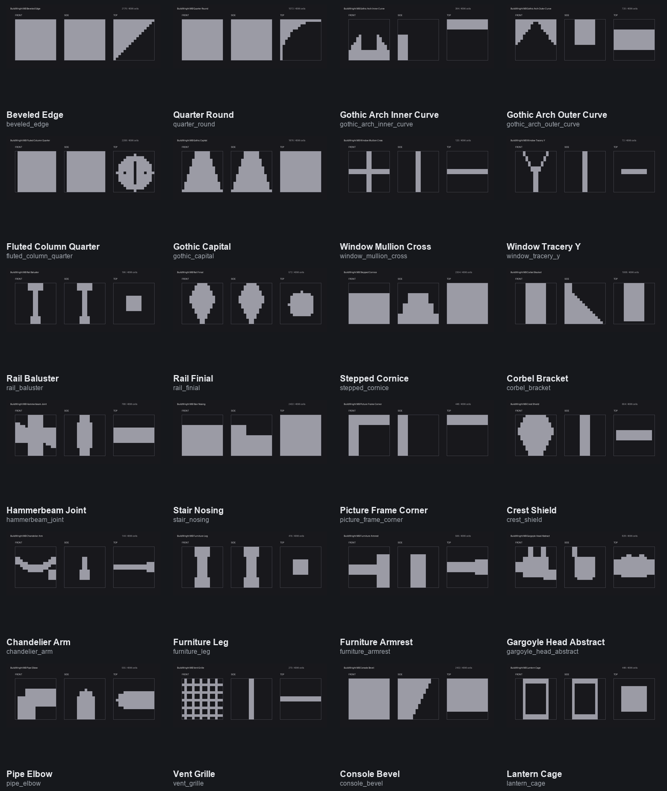

# BuildWright Optional Microblock Catalogue

**Astra Microblocks are an optional refinement layer, not the base BuildWright output.**

The authoritative workflow is vanilla-first: finish the architecture, vanilla detailing, furnishing and player-eye review before deciding whether any local contour/detail benefits from microblocks.

[Browse the optional detail-layer assets](catalog/visual/microblocks.md)

[Return to the vanilla visual catalogue](VISUAL_CATALOG.md)
