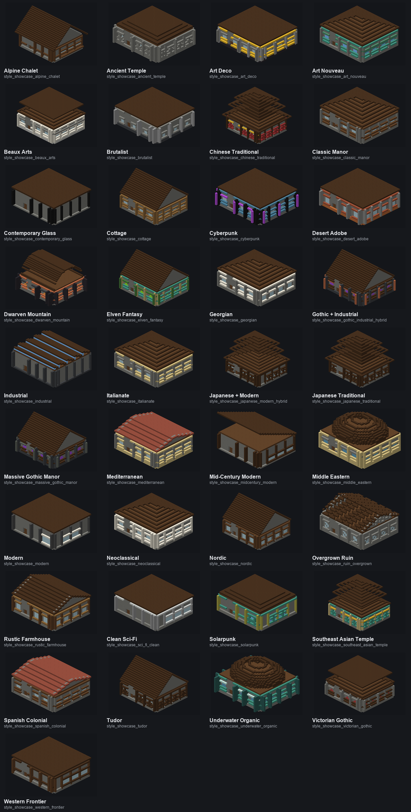
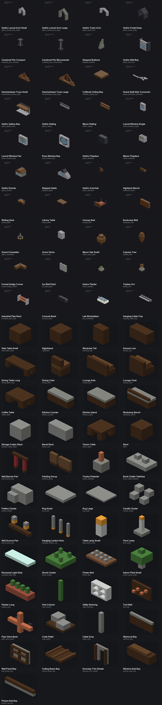
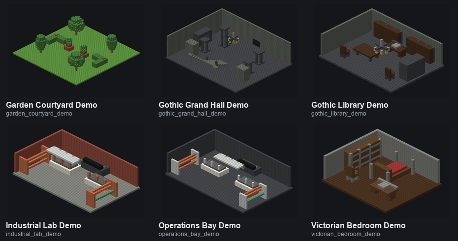
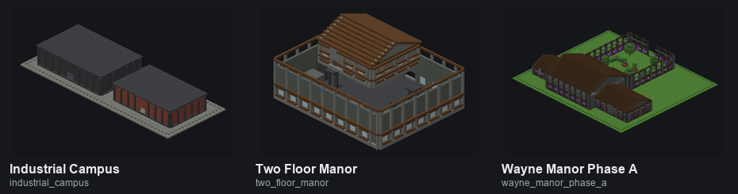

# BuildWright Vanilla Visual Catalogue

**This main catalogue is the vanilla foundation. Astra Microblocks are not part of the baseline shown here.**

The style cards are **style-language baselines**: massing, materials, facade rhythm, windows, and roof language. They are not the completed vanilla detail layer and should not be read as finished builds.

Pipeline: **vanilla base → complete vanilla architecture/detail/furnishing → in-game review → optional Astra Microblocks refinement**.

> Isometric images are deterministic renders of the actual compiled Litematic geometry using simplified material colors. They are not Minecraft screenshots or concept art.

## Vanilla style baselines

### 37 compiled baselines — 35 core styles + 2 style-blend demonstrations

[Browse vanilla style baselines](catalog/visual/styles.md)

## Vanilla fixture library

### 40 compiled vanilla fixtures

[Browse vanilla fixtures](catalog/visual/fixtures.md)

## Vanilla room / module baselines

### 6 vanilla examples

[Browse vanilla rooms and modules](catalog/visual/rooms.md)

## Vanilla whole-building baselines

### 3 regression projects

[Browse vanilla whole-building projects](catalog/visual/projects.md)

## Optional detail layer — deliberately separate

The retained Astra layer currently contains **24 microblock fixtures** and **1 hybrid room example**. It is not the default BuildWright output.

[Open the optional Astra Microblocks catalogue](MICROBLOCK_CATALOG.md)

## Other catalogues

- [Full inventory and history](CATALOG.md)
- [Machine-readable inventory](catalog/catalog.json)
- [Machine-readable visual manifest](catalog/visual/visual_manifest.json)
