# Vanilla Fixture Visual Catalogue

[← Vanilla Visual Catalogue](../../VISUAL_CATALOG.md)

**85 vanilla fixtures.** Astra fixtures are intentionally excluded from this baseline catalogue.

### architecture · arches

<table>
<tr>
<td width="33%" valign="top">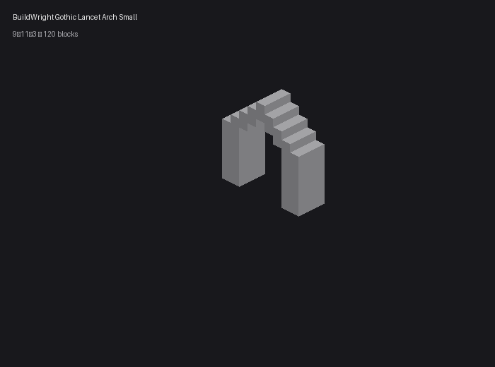 <b>Gothic Lancet Arch Small</b> <code>gothic_lancet_arch_small</code> 9 × 11 × 3 · 120 blocks</td>
<td width="33%" valign="top">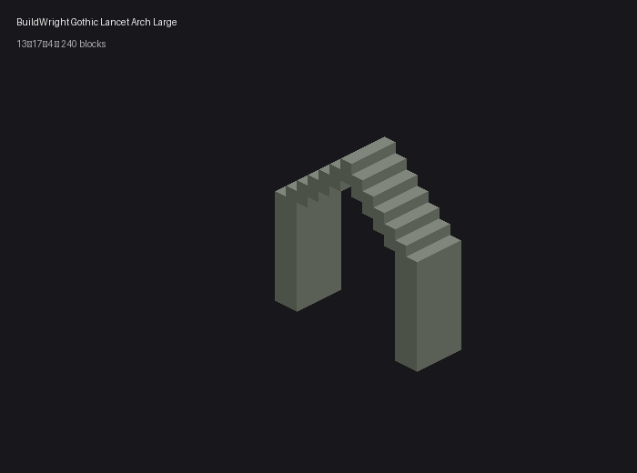 <b>Gothic Lancet Arch Large</b> <code>gothic_lancet_arch_large</code> 13 × 17 × 4 · 240 blocks</td>
<td width="33%" valign="top">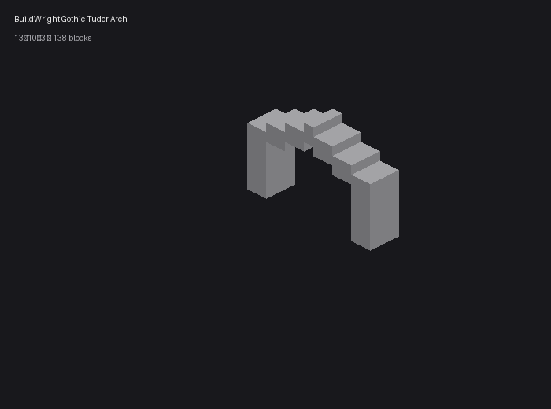 <b>Gothic Tudor Arch</b> <code>gothic_tudor_arch</code> 13 × 10 × 3 · 138 blocks</td>
</tr>
</table>

### architecture · buttresses

<table>
<tr>
<td width="33%" valign="top">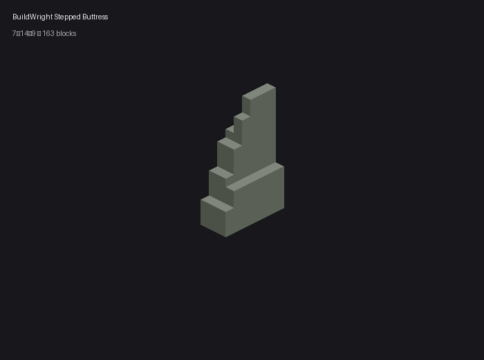 <b>Stepped Buttress</b> <code>stepped_buttress</code> 7 × 14 × 9 · 163 blocks</td>
<td></td>
<td></td>
</tr>
</table>

### architecture · ceilings

<table>
<tr>
<td width="33%" valign="top">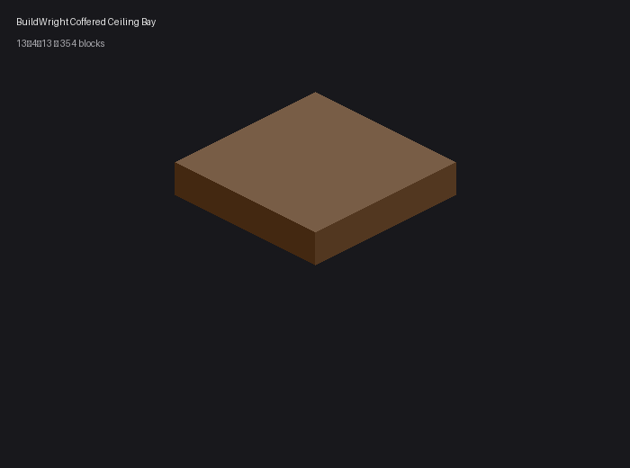 <b>Coffered Ceiling Bay</b> <code>coffered_ceiling_bay</code> 13 × 4 × 13 · 354 blocks</td>
<td width="33%" valign="top">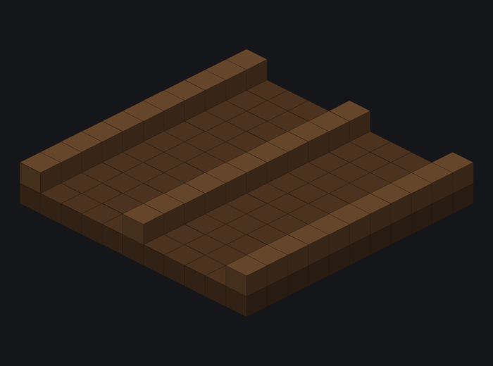 <b>Ceiling Beam Bay</b> <code>ceiling_beam_bay</code> 11 × 2 × 11 · 154 blocks</td>
<td></td>
</tr>
</table>

### architecture · columns_piers

<table>
<tr>
<td width="33%" valign="top">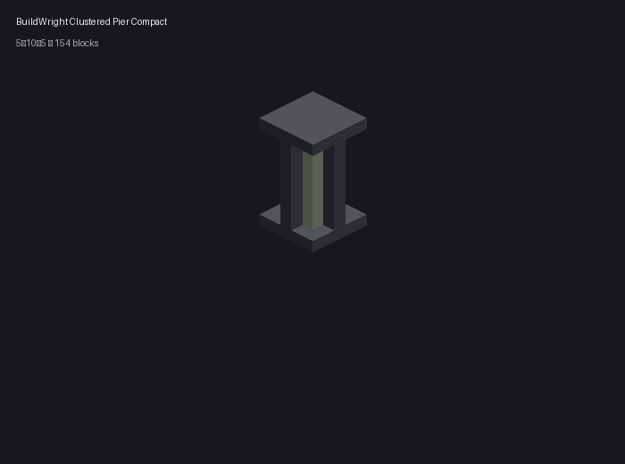 <b>Clustered Pier Compact</b> <code>clustered_pier_compact</code> 5 × 10 × 5 · 154 blocks</td>
<td width="33%" valign="top">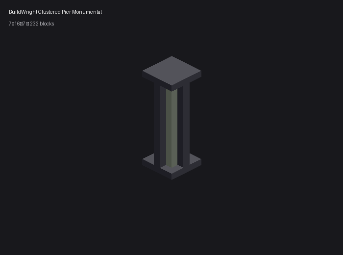 <b>Clustered Pier Monumental</b> <code>clustered_pier_monumental</code> 7 × 16 × 7 · 232 blocks</td>
<td></td>
</tr>
</table>

### architecture · door_surrounds

<table>
<tr>
<td width="33%" valign="top">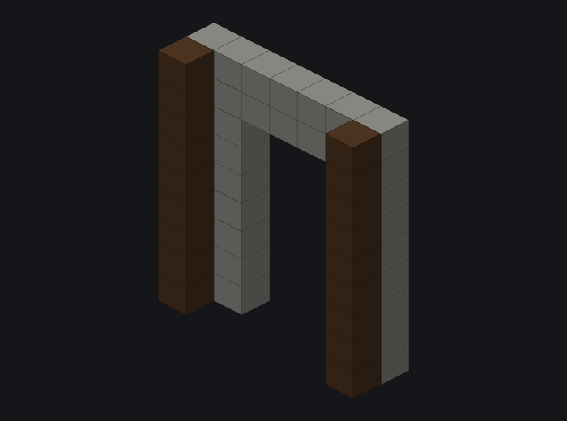 <b>Doorway Trim Simple</b> <code>doorway_trim_simple</code> 7 × 9 × 2 · 60 blocks</td>
<td></td>
<td></td>
</tr>
</table>

### architecture · dormers

<table>
<tr>
<td width="33%" valign="top">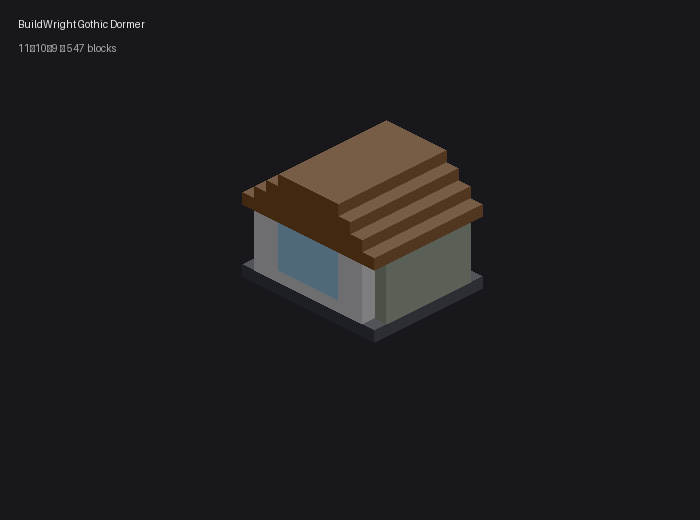 <b>Gothic Dormer</b> <code>gothic_dormer</code> 11 × 10 × 9 · 547 blocks</td>
<td></td>
<td></td>
</tr>
</table>

### architecture · fireplaces

<table>
<tr>
<td width="33%" valign="top">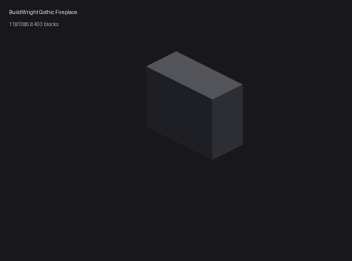 <b>Gothic Fireplace</b> <code>gothic_fireplace</code> 11 × 10 × 5 · 403 blocks</td>
<td width="33%" valign="top">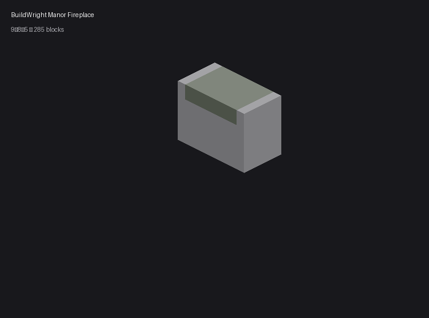 <b>Manor Fireplace</b> <code>manor_fireplace</code> 9 × 8 × 5 · 285 blocks</td>
<td></td>
</tr>
</table>

### architecture · gables

<table>
<tr>
<td width="33%" valign="top">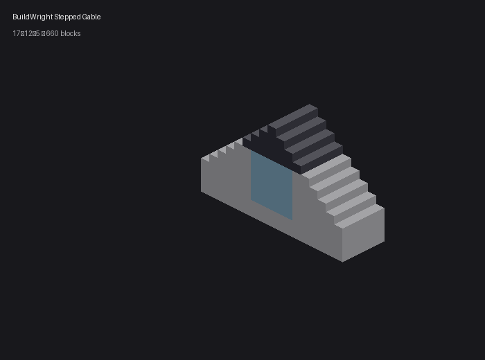 <b>Stepped Gable</b> <code>stepped_gable</code> 17 × 12 × 5 · 660 blocks</td>
<td></td>
<td></td>
</tr>
</table>

### architecture · galleries

<table>
<tr>
<td width="33%" valign="top">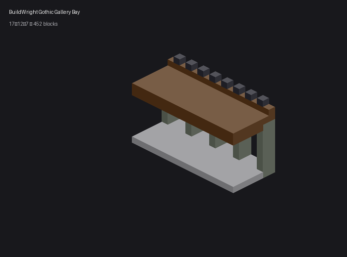 <b>Gothic Gallery Bay</b> <code>gothic_gallery_bay</code> 17 × 12 × 7 · 452 blocks</td>
<td></td>
<td></td>
</tr>
</table>

### architecture · interior_bays

<table>
<tr>
<td width="33%" valign="top">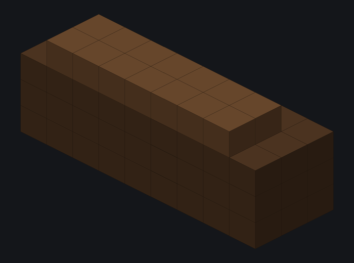 <b>Window Seat Bay</b> <code>window_seat_bay</code> 9 × 4 × 3 · 95 blocks</td>
<td></td>
<td></td>
</tr>
</table>

### architecture · portals

<table>
<tr>
<td width="33%" valign="top">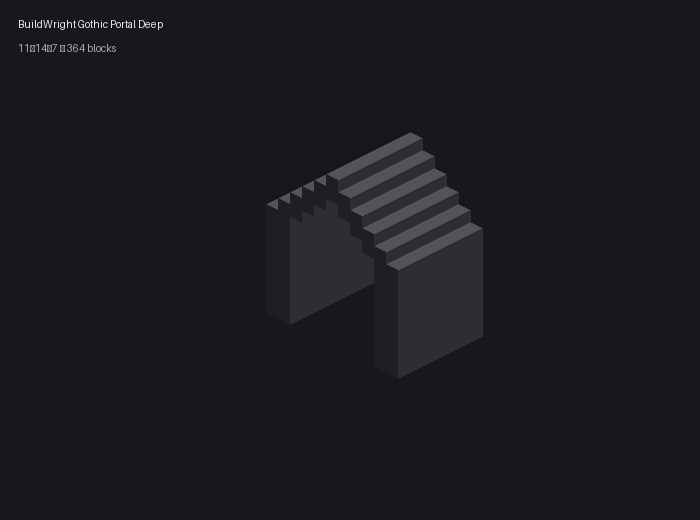 <b>Gothic Portal Deep</b> <code>gothic_portal_deep</code> 11 × 14 × 7 · 364 blocks</td>
<td></td>
<td></td>
</tr>
</table>

### architecture · railings

<table>
<tr>
<td width="33%" valign="top">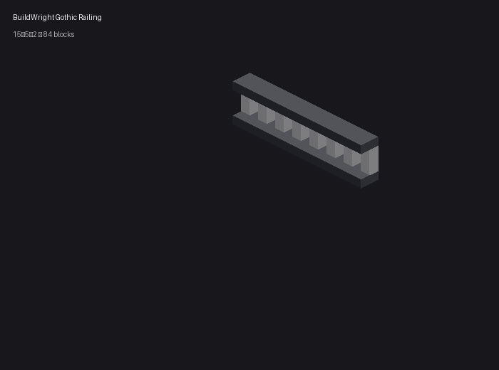 <b>Gothic Railing</b> <code>gothic_railing</code> 15 × 5 × 2 · 84 blocks</td>
<td width="33%" valign="top">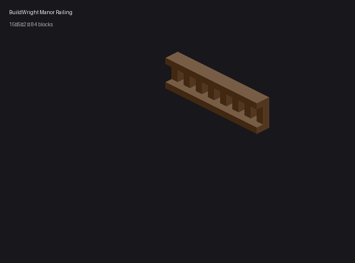 <b>Manor Railing</b> <code>manor_railing</code> 15 × 5 × 2 · 84 blocks</td>
<td></td>
</tr>
</table>

### architecture · roofs

<table>
<tr>
<td width="33%" valign="top">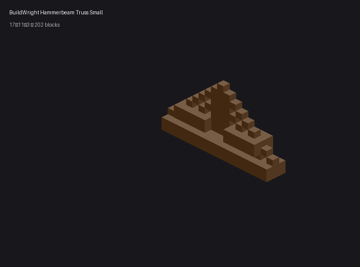 <b>Hammerbeam Truss Small</b> <code>hammerbeam_truss_small</code> 17 × 11 × 3 · 202 blocks</td>
<td width="33%" valign="top">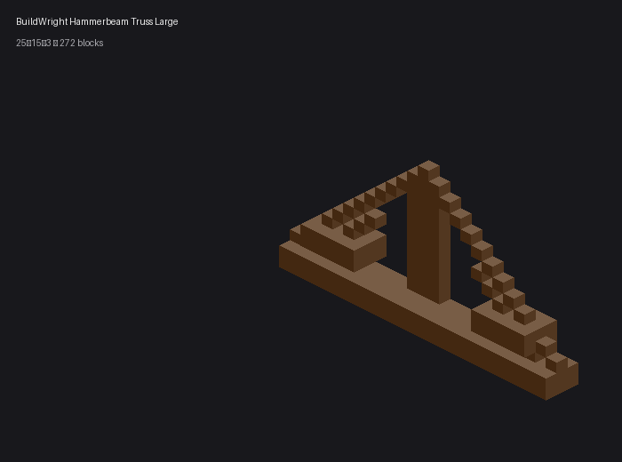 <b>Hammerbeam Truss Large</b> <code>hammerbeam_truss_large</code> 25 × 15 × 3 · 272 blocks</td>
<td></td>
</tr>
</table>

### architecture · stairs

<table>
<tr>
<td width="33%" valign="top">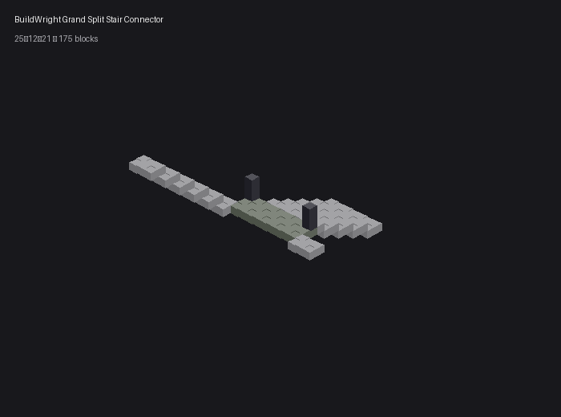 <b>Grand Split Stair Connector</b> <code>grand_split_stair_connector</code> 25 × 12 × 21 · 175 blocks</td>
<td></td>
<td></td>
</tr>
</table>

### architecture · trim

<table>
<tr>
<td width="33%" valign="top">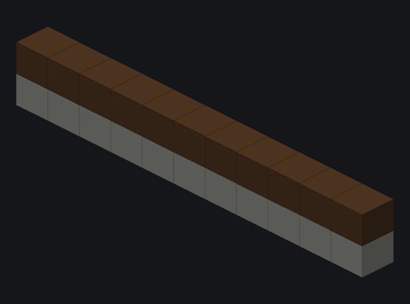 <b>Picture Rail Bay</b> <code>picture_rail_bay</code> 11 × 2 × 1 · 22 blocks</td>
<td></td>
<td></td>
</tr>
</table>

### architecture · wall_bays

<table>
<tr>
<td width="33%" valign="top">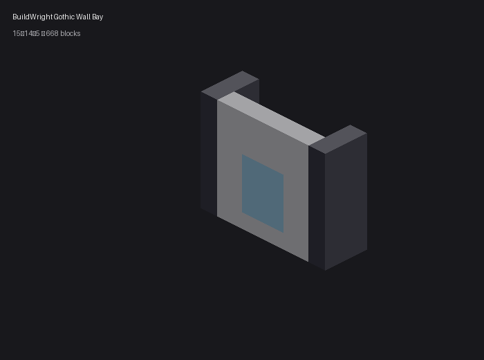 <b>Gothic Wall Bay</b> <code>gothic_wall_bay</code> 15 × 14 × 5 · 668 blocks</td>
<td></td>
<td></td>
</tr>
</table>

### architecture · wall_paneling

<table>
<tr>
<td width="33%" valign="top">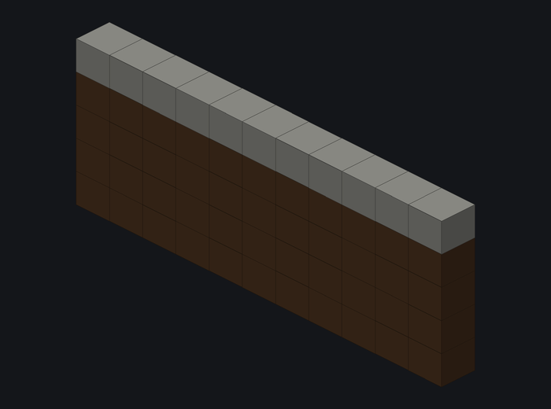 <b>Wainscot Bay</b> <code>wainscot_bay</code> 11 × 5 × 1 · 55 blocks</td>
<td width="33%" valign="top">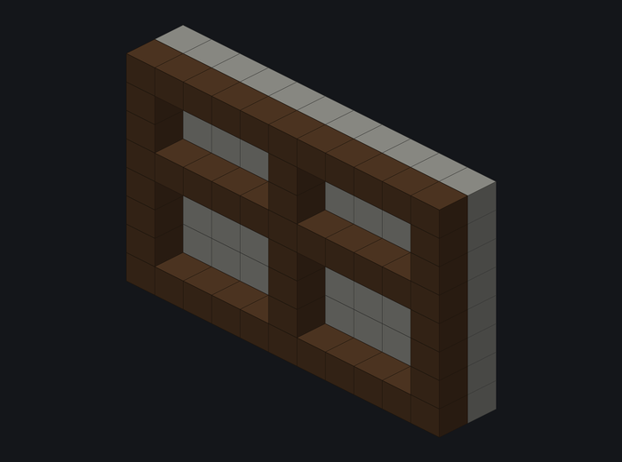 <b>Wall Panel Bay</b> <code>wall_panel_bay</code> 11 × 8 × 2 · 136 blocks</td>
<td></td>
</tr>
</table>

### architecture · windows

<table>
<tr>
<td width="33%" valign="top">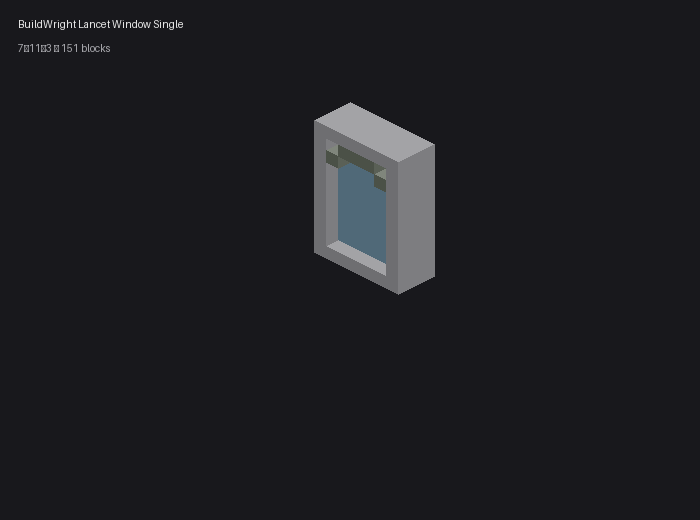 <b>Lancet Window Single</b> <code>lancet_window_single</code> 7 × 11 × 3 · 151 blocks</td>
<td width="33%" valign="top">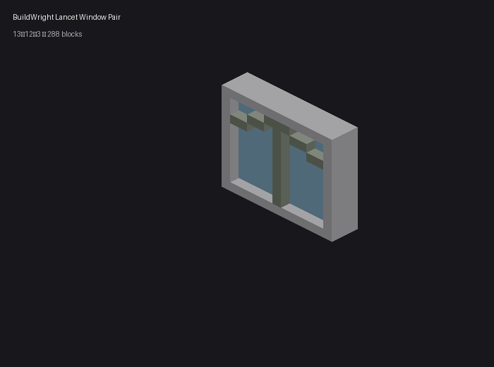 <b>Lancet Window Pair</b> <code>lancet_window_pair</code> 13 × 12 × 3 · 288 blocks</td>
<td width="33%" valign="top">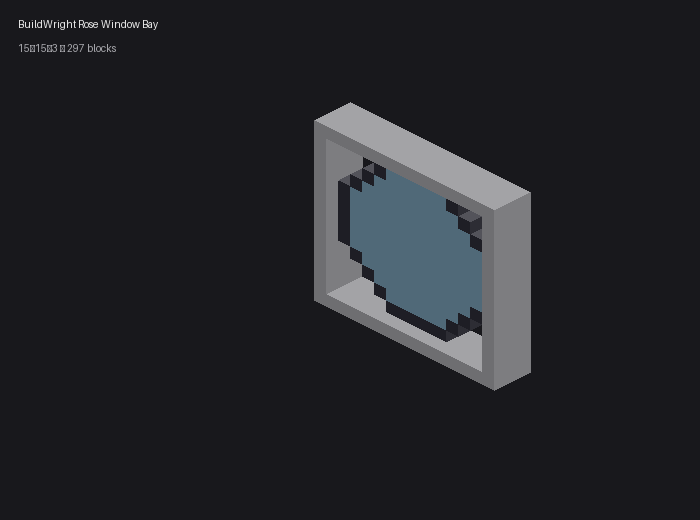 <b>Rose Window Bay</b> <code>rose_window_bay</code> 15 × 15 × 3 · 297 blocks</td>
</tr>
</table>

### decor · art

<table>
<tr>
<td width="33%" valign="top">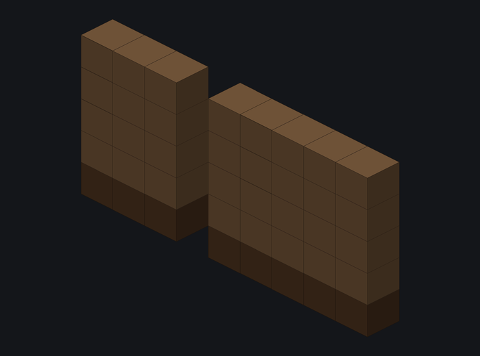 <b>Painting Group</b> <code>painting_group</code> 9 × 5 × 1 · 40 blocks</td>
<td></td>
<td></td>
</tr>
</table>

### decor · banners

<table>
<tr>
<td width="33%" valign="top">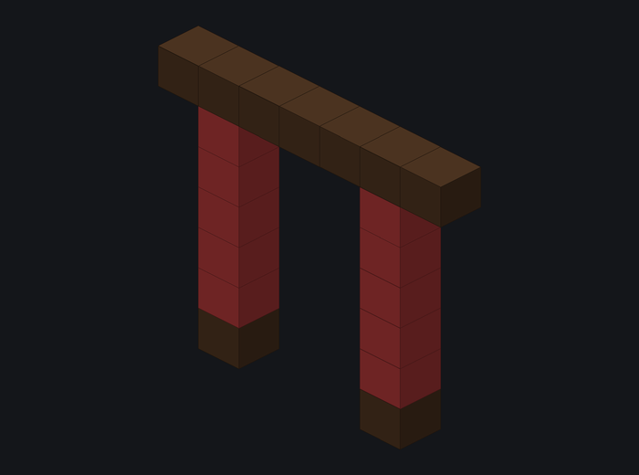 <b>Wall Banner Pair</b> <code>wall_banner_pair</code> 7 × 7 × 1 · 19 blocks</td>
<td></td>
<td></td>
</tr>
</table>

### decor · books

<table>
<tr>
<td width="33%" valign="top">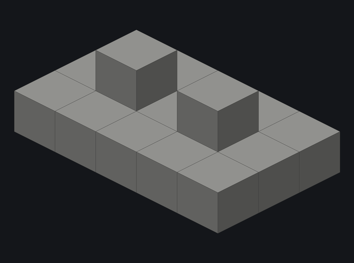 <b>Book Clutter Tabletop</b> <code>book_clutter_tabletop</code> 5 × 2 × 3 · 17 blocks</td>
<td></td>
<td></td>
</tr>
</table>

### decor · displays

<table>
<tr>
<td width="33%" valign="top">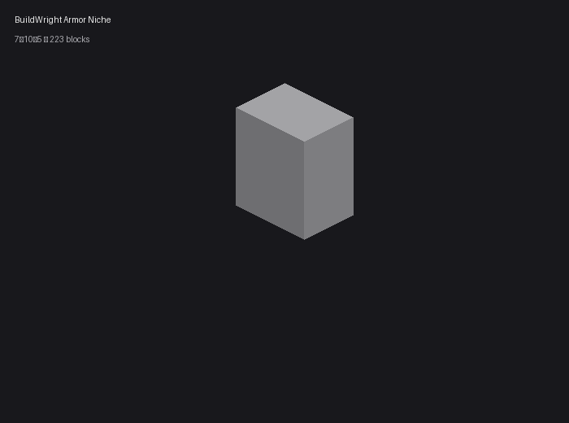 <b>Armor Niche</b> <code>armor_niche</code> 7 × 10 × 5 · 223 blocks</td>
<td width="33%" valign="top">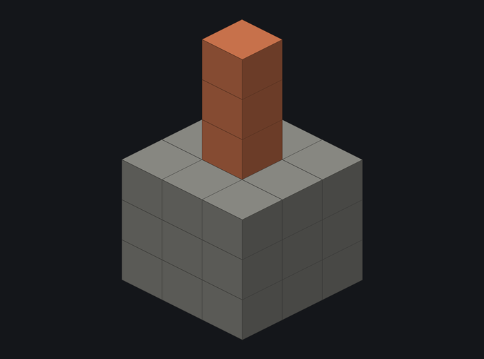 <b>Trophy Pedestal</b> <code>trophy_pedestal</code> 3 × 6 × 3 · 30 blocks</td>
<td></td>
</tr>
</table>

### decor · lighting

<table>
<tr>
<td width="33%" valign="top">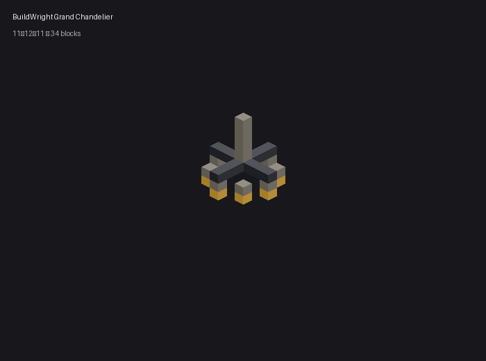 <b>Grand Chandelier</b> <code>grand_chandelier</code> 11 × 12 × 11 · 34 blocks</td>
<td width="33%" valign="top"> <b>Candle Cluster</b> <code>candle_cluster</code> 4 × 1 × 3 · 4 blocks</td>
<td width="33%" valign="top">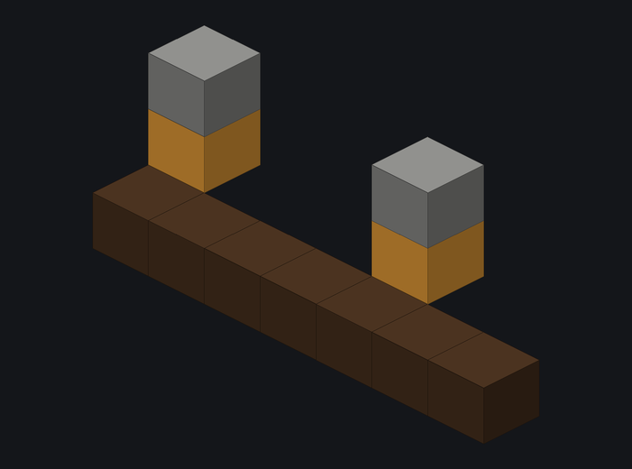 <b>Wall Sconce Pair</b> <code>wall_sconce_pair</code> 7 × 5 × 1 · 11 blocks</td>
</tr>
<tr>
<td width="33%" valign="top">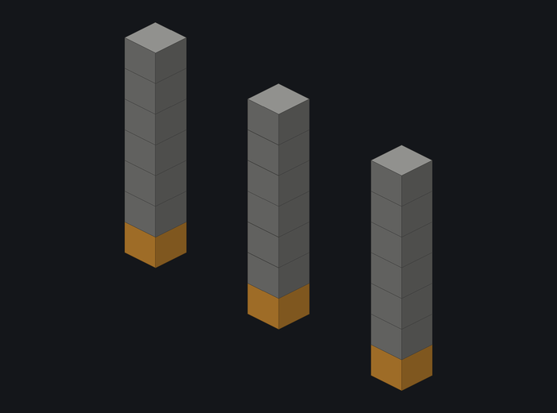 <b>Hanging Lantern Row</b> <code>hanging_lantern_row</code> 9 × 7 × 3 · 21 blocks</td>
<td width="33%" valign="top">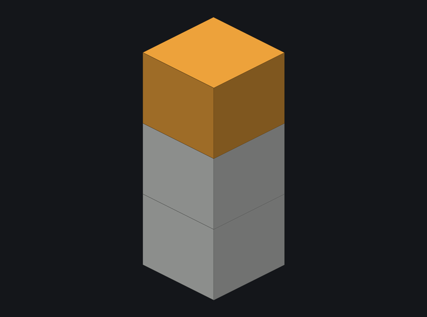 <b>Table Lamp Small</b> <code>table_lamp_small</code> 3 × 4 × 3 · 3 blocks</td>
<td width="33%" valign="top">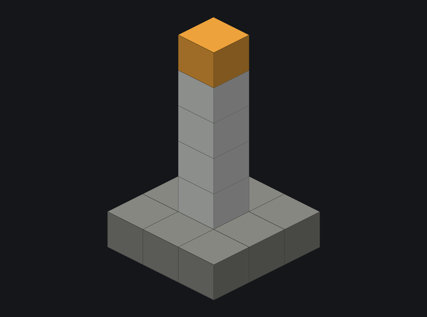 <b>Floor Lamp</b> <code>floor_lamp</code> 3 × 7 × 3 · 14 blocks</td>
</tr>
<tr>
<td width="33%" valign="top">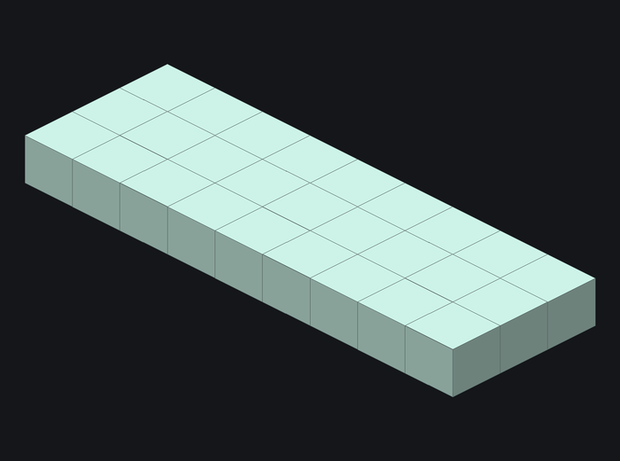 <b>Recessed Light Strip</b> <code>recessed_light_strip</code> 9 × 1 × 3 · 27 blocks</td>
<td></td>
<td></td>
</tr>
</table>

### decor · pottery

<table>
<tr>
<td width="33%" valign="top">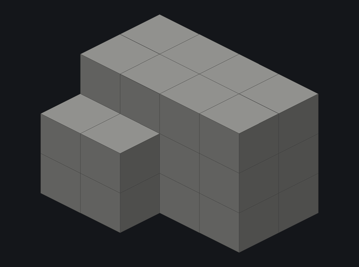 <b>Pottery Cluster</b> <code>pottery_cluster</code> 5 × 3 × 4 · 24 blocks</td>
<td></td>
<td></td>
</tr>
</table>

### decor · rugs

<table>
<tr>
<td width="33%" valign="top">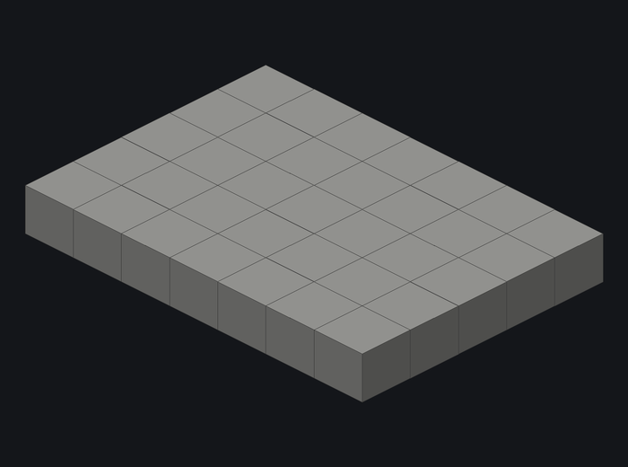 <b>Rug Small</b> <code>rug_small</code> 7 × 1 × 5 · 35 blocks</td>
<td width="33%" valign="top">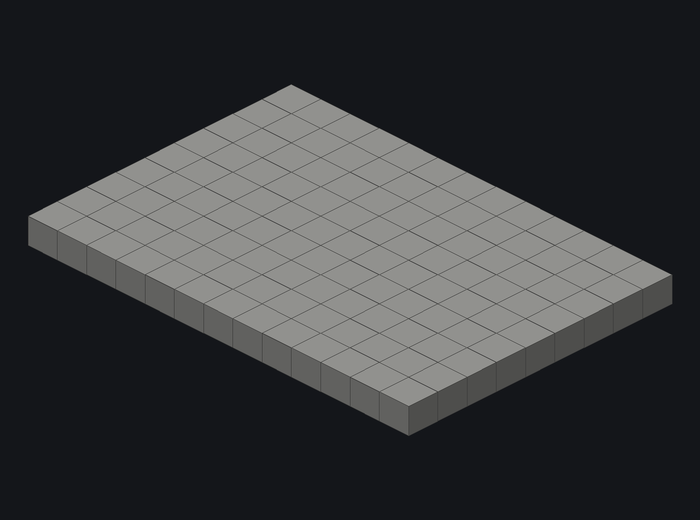 <b>Rug Large</b> <code>rug_large</code> 13 × 1 × 9 · 117 blocks</td>
<td></td>
</tr>
</table>

### furniture · bedroom

<table>
<tr>
<td width="33%" valign="top"> <b>Nightstand</b> <code>nightstand</code> 3 × 3 × 3 · 27 blocks</td>
<td></td>
<td></td>
</tr>
</table>

### furniture · beds

<table>
<tr>
<td width="33%" valign="top">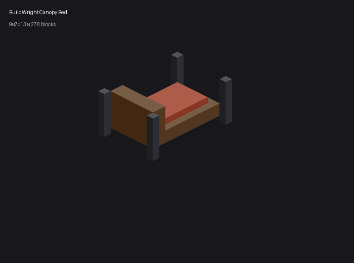 <b>Canopy Bed</b> <code>canopy_bed</code> 9 × 7 × 13 · 278 blocks</td>
<td></td>
<td></td>
</tr>
</table>

### furniture · desks

<table>
<tr>
<td width="33%" valign="top">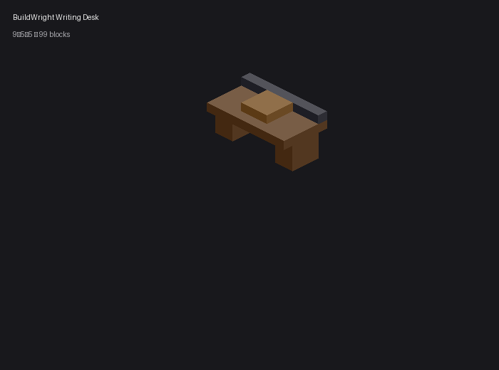 <b>Writing Desk</b> <code>writing_desk</code> 9 × 5 × 5 · 99 blocks</td>
<td></td>
<td></td>
</tr>
</table>

### furniture · kitchen

<table>
<tr>
<td width="33%" valign="top">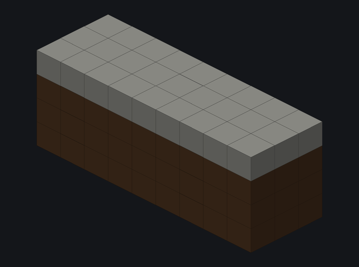 <b>Kitchen Counter</b> <code>kitchen_counter</code> 9 × 4 × 3 · 108 blocks</td>
<td width="33%" valign="top">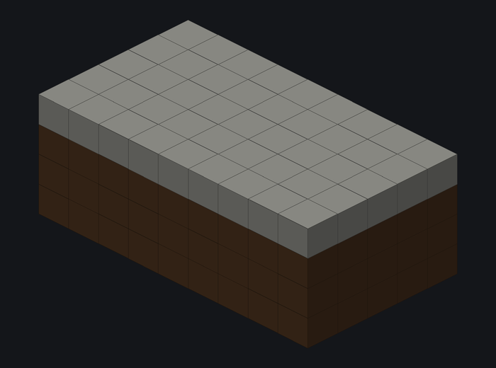 <b>Kitchen Island</b> <code>kitchen_island</code> 9 × 4 × 5 · 180 blocks</td>
<td></td>
</tr>
</table>

### furniture · seating

<table>
<tr>
<td width="33%" valign="top">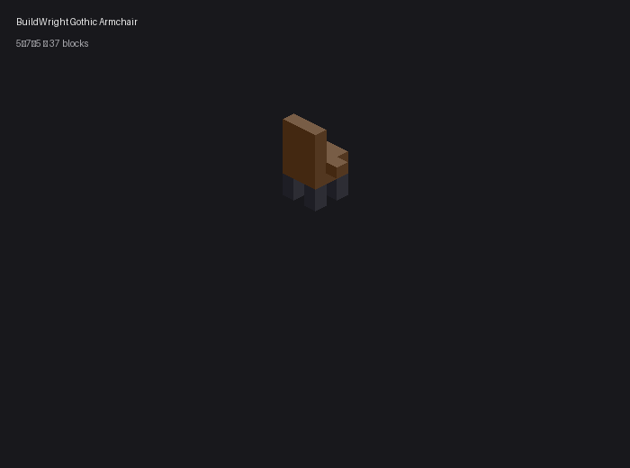 <b>Gothic Armchair</b> <code>gothic_armchair</code> 5 × 7 × 5 · 37 blocks</td>
<td width="33%" valign="top">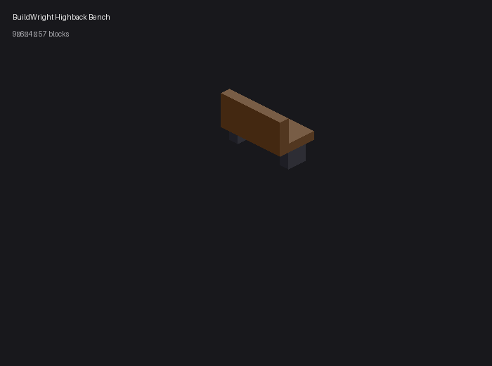 <b>Highback Bench</b> <code>highback_bench</code> 9 × 6 × 4 · 57 blocks</td>
<td width="33%" valign="top">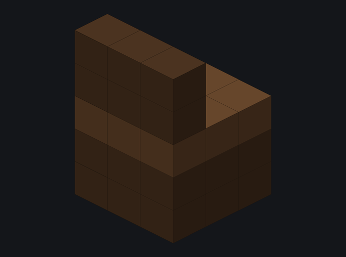 <b>Dining Chair</b> <code>dining_chair</code> 3 × 5 × 3 · 33 blocks</td>
</tr>
<tr>
<td width="33%" valign="top">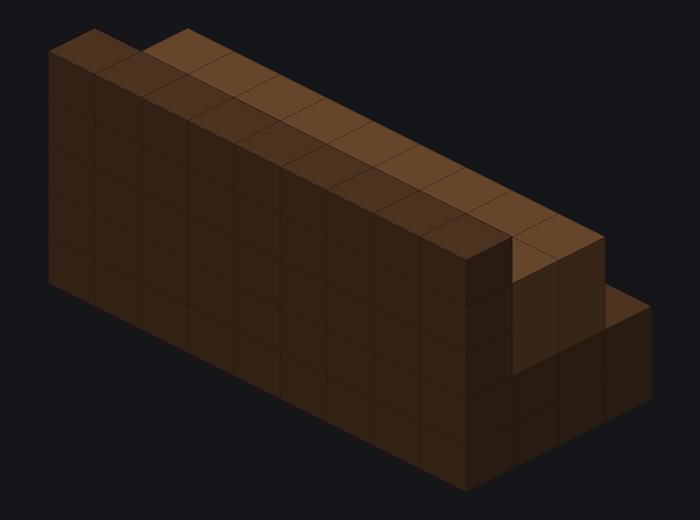 <b>Lounge Sofa</b> <code>lounge_sofa</code> 9 × 5 × 4 · 135 blocks</td>
<td width="33%" valign="top">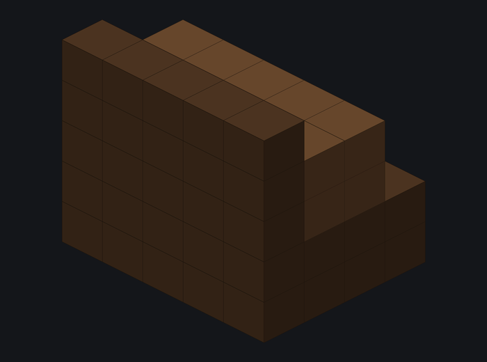 <b>Lounge Chair</b> <code>lounge_chair</code> 5 × 5 × 4 · 75 blocks</td>
<td width="33%" valign="top">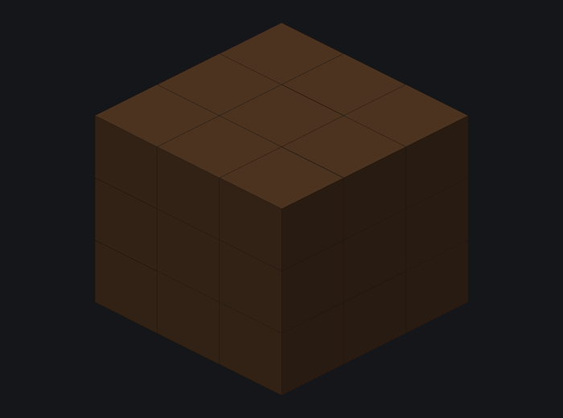 <b>Stool</b> <code>stool</code> 3 × 3 × 3 · 27 blocks</td>
</tr>
</table>

### furniture · storage

<table>
<tr>
<td width="33%" valign="top">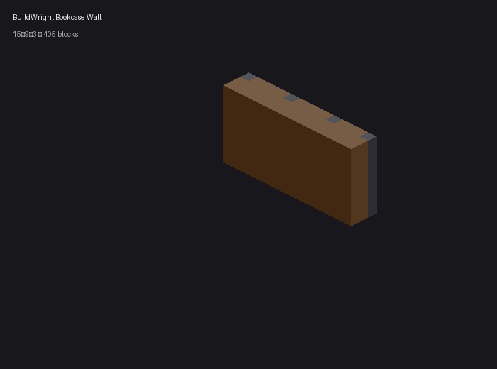 <b>Bookcase Wall</b> <code>bookcase_wall</code> 15 × 9 × 3 · 405 blocks</td>
<td width="33%" valign="top">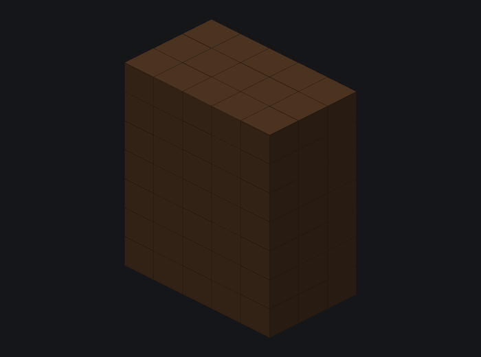 <b>Wardrobe Tall</b> <code>wardrobe_tall</code> 5 × 7 × 3 · 105 blocks</td>
<td width="33%" valign="top">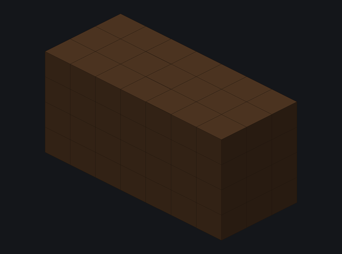 <b>Dresser Low</b> <code>dresser_low</code> 7 × 4 × 3 · 84 blocks</td>
</tr>
<tr>
<td width="33%" valign="top">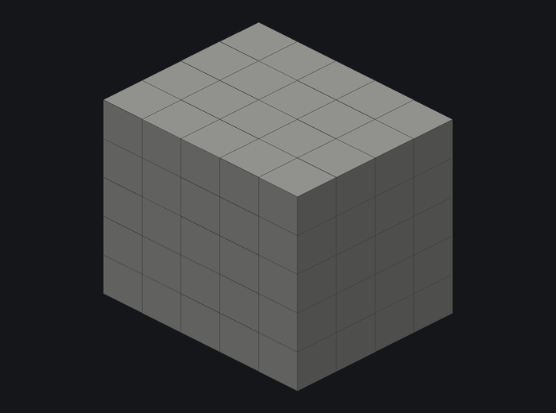 <b>Storage Crates Stack</b> <code>storage_crates_stack</code> 5 × 5 × 4 · 100 blocks</td>
<td width="33%" valign="top">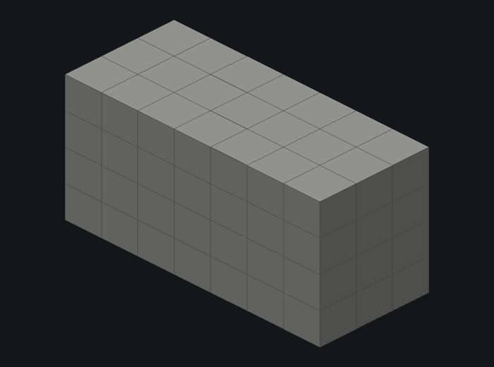 <b>Barrel Rack</b> <code>barrel_rack</code> 7 × 4 × 3 · 84 blocks</td>
<td></td>
</tr>
</table>

### furniture · tables

<table>
<tr>
<td width="33%" valign="top">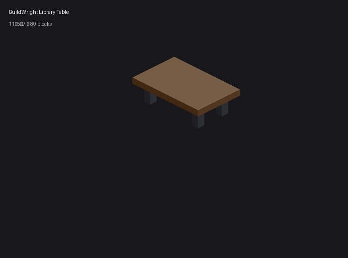 <b>Library Table</b> <code>library_table</code> 11 × 5 × 7 · 89 blocks</td>
<td width="33%" valign="top"> <b>Side Table Small</b> <code>side_table_small</code> 3 × 3 × 3 · 27 blocks</td>
<td width="33%" valign="top">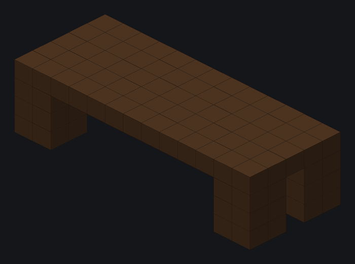 <b>Dining Table Long</b> <code>dining_table_long</code> 13 × 4 × 5 · 113 blocks</td>
</tr>
<tr>
<td width="33%" valign="top">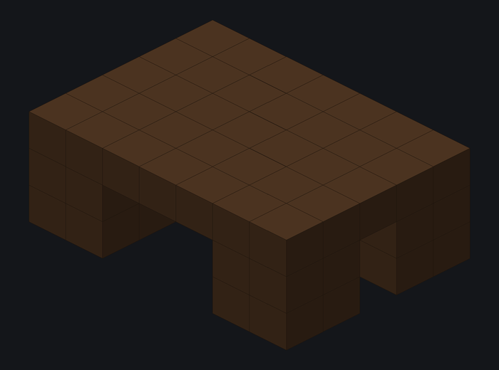 <b>Coffee Table</b> <code>coffee_table</code> 7 × 3 × 5 · 67 blocks</td>
<td width="33%" valign="top">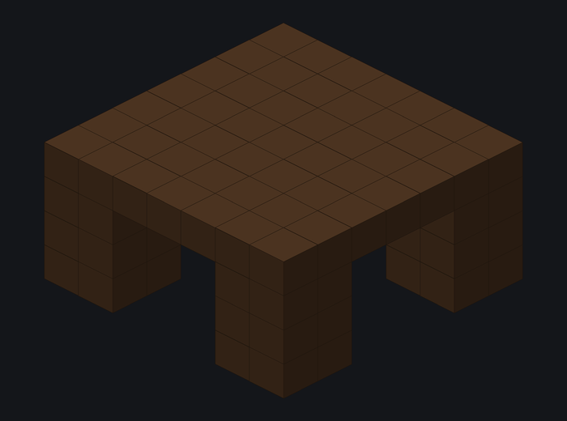 <b>Tavern Table</b> <code>tavern_table</code> 7 × 4 × 7 · 97 blocks</td>
<td></td>
</tr>
</table>

### furniture · workshop

<table>
<tr>
<td width="33%" valign="top">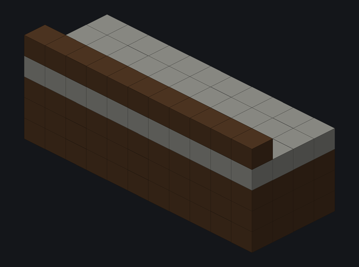 <b>Workshop Bench</b> <code>workshop_bench</code> 11 × 5 × 4 · 187 blocks</td>
<td></td>
<td></td>
</tr>
</table>

### mechanical · cables

<table>
<tr>
<td width="33%" valign="top">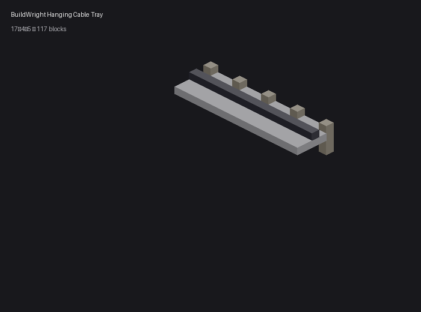 <b>Hanging Cable Tray</b> <code>hanging_cable_tray</code> 17 × 4 × 5 · 117 blocks</td>
<td width="33%" valign="top">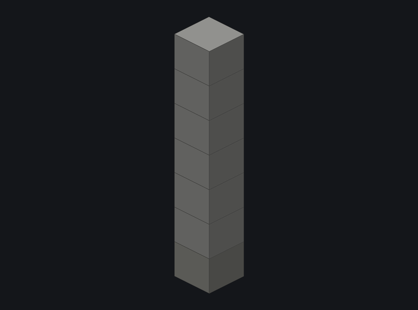 <b>Cable Drop</b> <code>cable_drop</code> 3 × 7 × 3 · 7 blocks</td>
<td></td>
</tr>
</table>

### mechanical · consoles

<table>
<tr>
<td width="33%" valign="top">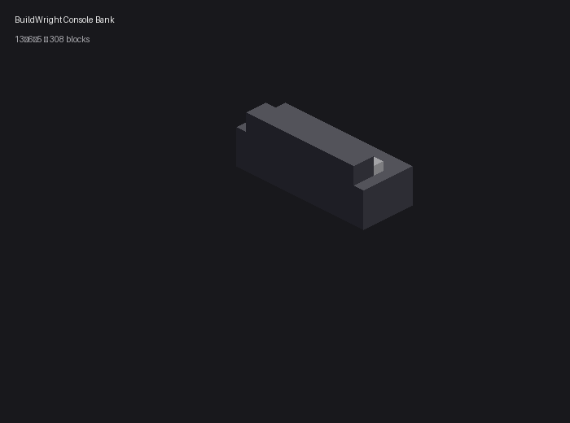 <b>Console Bank</b> <code>console_bank</code> 13 × 6 × 5 · 308 blocks</td>
<td></td>
<td></td>
</tr>
</table>

### mechanical · lab

<table>
<tr>
<td width="33%" valign="top">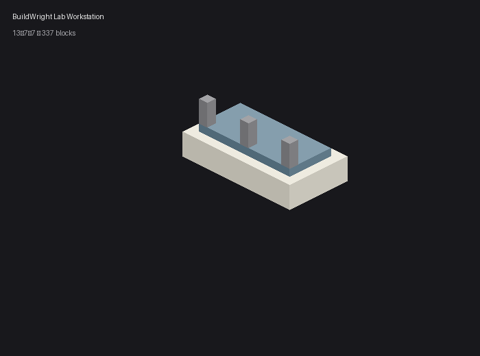 <b>Lab Workstation</b> <code>lab_workstation</code> 13 × 7 × 7 · 337 blocks</td>
<td></td>
<td></td>
</tr>
</table>

### mechanical · pipes

<table>
<tr>
<td width="33%" valign="top">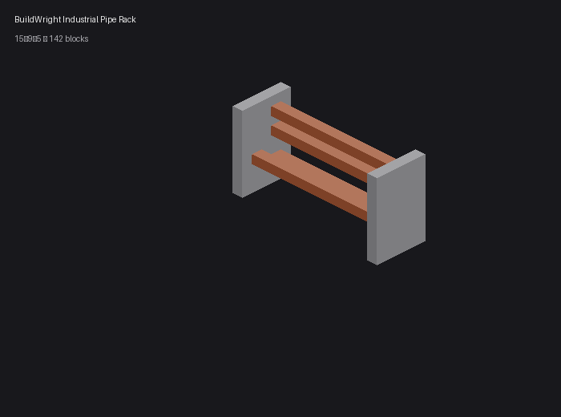 <b>Industrial Pipe Rack</b> <code>industrial_pipe_rack</code> 15 × 9 × 5 · 142 blocks</td>
<td width="33%" valign="top">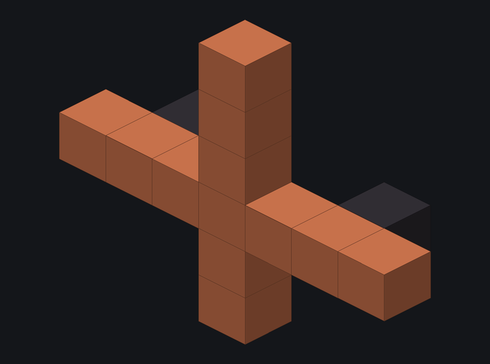 <b>Pipe Valve Bank</b> <code>pipe_valve_bank</code> 7 × 6 × 3 · 14 blocks</td>
<td></td>
</tr>
</table>

### mechanical · storage

<table>
<tr>
<td width="33%" valign="top">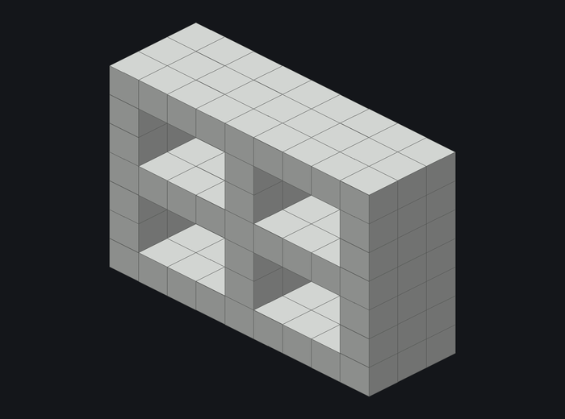 <b>Utility Shelving</b> <code>utility_shelving</code> 9 × 7 × 3 · 117 blocks</td>
<td width="33%" valign="top">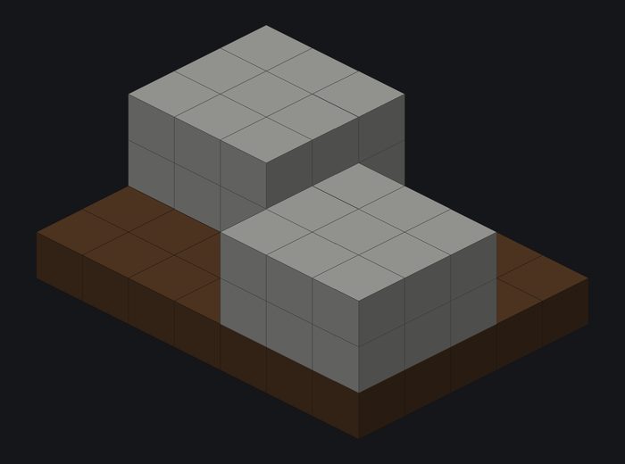 <b>Crate Pallet</b> <code>crate_pallet</code> 7 × 3 × 5 · 71 blocks</td>
<td></td>
</tr>
</table>

### mechanical · tools

<table>
<tr>
<td width="33%" valign="top">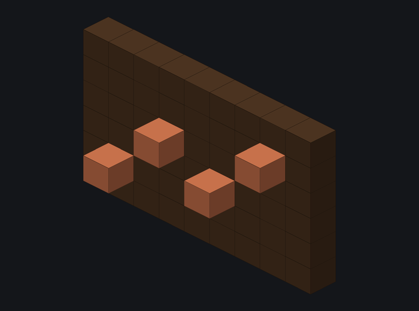 <b>Tool Wall</b> <code>tool_wall</code> 9 × 6 × 2 · 58 blocks</td>
<td></td>
<td></td>
</tr>
</table>

### vegetation · flower_beds

<table>
<tr>
<td width="33%" valign="top">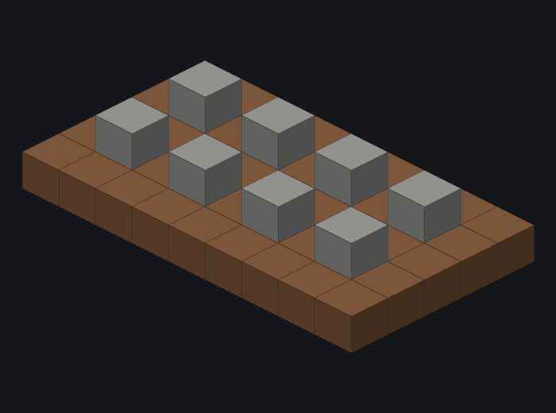 <b>Flower Bed</b> <code>flower_bed</code> 9 × 2 × 5 · 53 blocks</td>
<td></td>
<td></td>
</tr>
</table>

### vegetation · hedges

<table>
<tr>
<td width="33%" valign="top">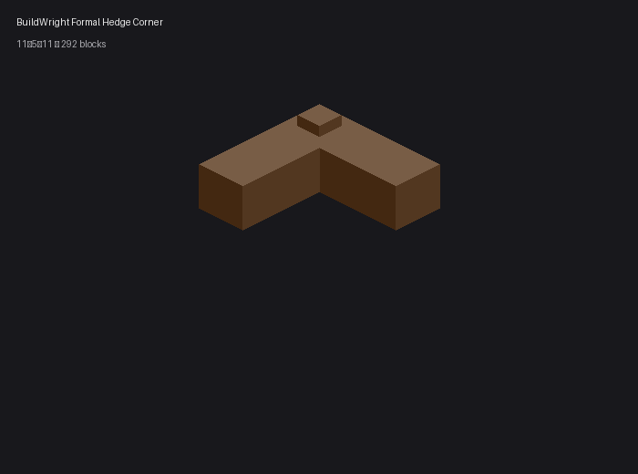 <b>Formal Hedge Corner</b> <code>formal_hedge_corner</code> 11 × 5 × 11 · 292 blocks</td>
<td></td>
<td></td>
</tr>
</table>

### vegetation · indoor_plants

<table>
<tr>
<td width="33%" valign="top">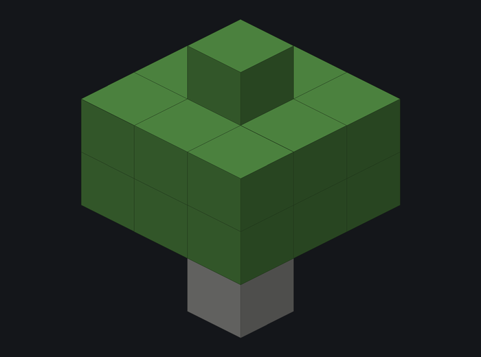 <b>Indoor Plant Small</b> <code>indoor_plant_small</code> 3 × 5 × 3 · 21 blocks</td>
<td></td>
<td></td>
</tr>
</table>

### vegetation · ivy

<table>
<tr>
<td width="33%" valign="top">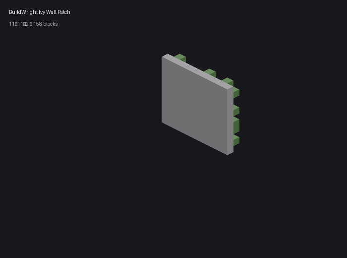 <b>Ivy Wall Patch</b> <code>ivy_wall_patch</code> 11 × 11 × 2 · 158 blocks</td>
<td></td>
<td></td>
</tr>
</table>

### vegetation · planters

<table>
<tr>
<td width="33%" valign="top">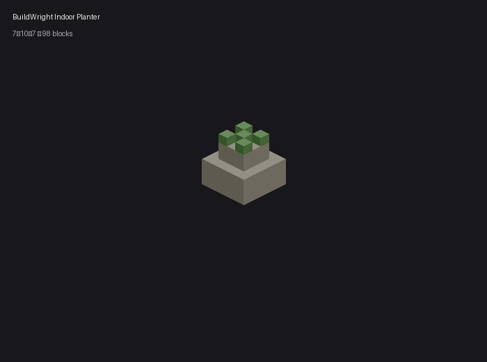 <b>Indoor Planter</b> <code>indoor_planter</code> 7 × 10 × 7 · 98 blocks</td>
<td width="33%" valign="top">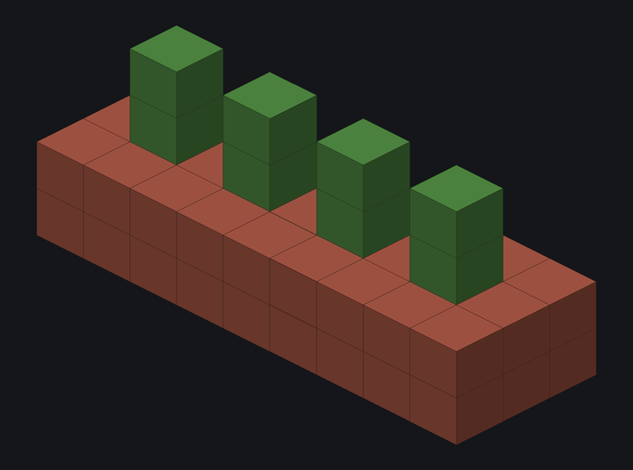 <b>Planter Long</b> <code>planter_long</code> 9 × 4 × 3 · 62 blocks</td>
<td></td>
</tr>
</table>

### vegetation · shrubs

<table>
<tr>
<td width="33%" valign="top">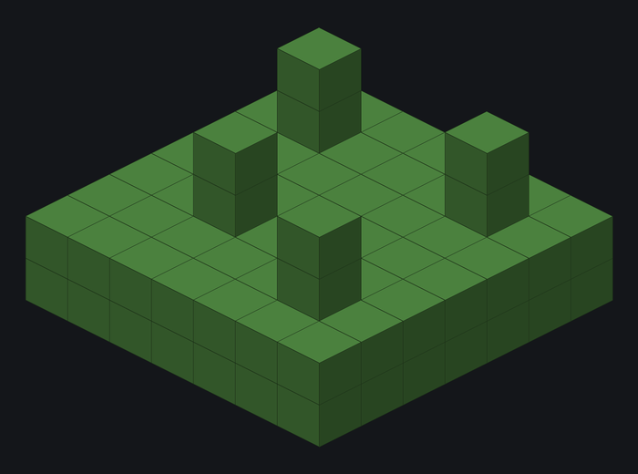 <b>Shrub Cluster</b> <code>shrub_cluster</code> 7 × 4 × 7 · 106 blocks</td>
<td></td>
<td></td>
</tr>
</table>

### vegetation · topiary

<table>
<tr>
<td width="33%" valign="top">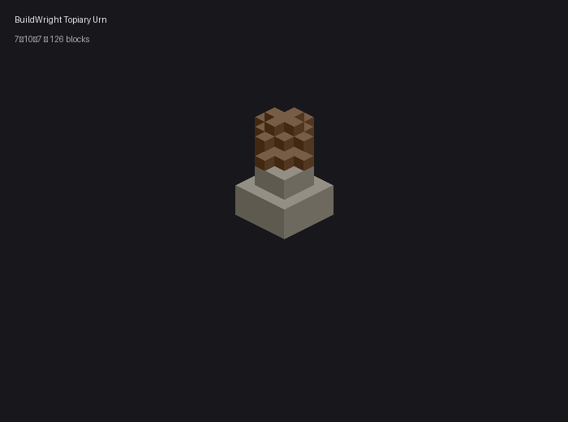 <b>Topiary Urn</b> <code>topiary_urn</code> 7 × 10 × 7 · 126 blocks</td>
<td></td>
<td></td>
</tr>
</table>

### vegetation · trees

<table>
<tr>
<td width="33%" valign="top">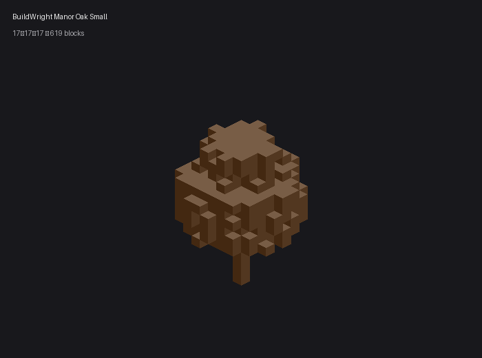 <b>Manor Oak Small</b> <code>manor_oak_small</code> 17 × 17 × 17 · 619 blocks</td>
<td width="33%" valign="top">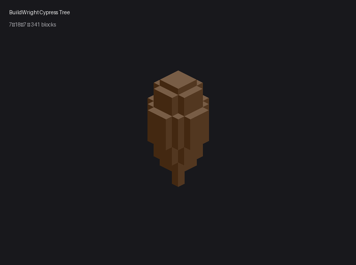 <b>Cypress Tree</b> <code>cypress_tree</code> 7 × 18 × 7 · 341 blocks</td>
<td></td>
</tr>
</table>

### vegetation · vines

<table>
<tr>
<td width="33%" valign="top">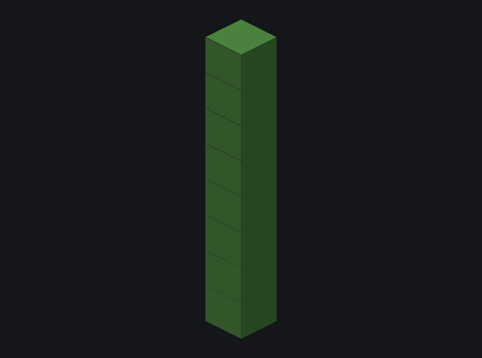 <b>Vine Column</b> <code>vine_column</code> 1 × 8 × 1 · 8 blocks</td>
<td></td>
<td></td>
</tr>
</table>
