# Fixture Visual Catalogue

[← Visual Catalogue](../../VISUAL_CATALOG.md)

## Vanilla — 40 fixtures

### architecture · arches

<table>
<tr>
<td width="33%" valign="top"> <b>Gothic Lancet Arch Small</b> <code>gothic_lancet_arch_small</code> 9 × 11 × 3 · 120 blocks</td>
<td width="33%" valign="top"> <b>Gothic Lancet Arch Large</b> <code>gothic_lancet_arch_large</code> 13 × 17 × 4 · 240 blocks</td>
<td width="33%" valign="top"> <b>Gothic Tudor Arch</b> <code>gothic_tudor_arch</code> 13 × 10 × 3 · 138 blocks</td>
</tr>
</table>

### architecture · buttresses

<table>
<tr>
<td width="33%" valign="top"> <b>Stepped Buttress</b> <code>stepped_buttress</code> 7 × 14 × 9 · 163 blocks</td>
<td></td>
<td></td>
</tr>
</table>

### architecture · ceilings

<table>
<tr>
<td width="33%" valign="top"> <b>Coffered Ceiling Bay</b> <code>coffered_ceiling_bay</code> 13 × 4 × 13 · 354 blocks</td>
<td></td>
<td></td>
</tr>
</table>

### architecture · columns_piers

<table>
<tr>
<td width="33%" valign="top"> <b>Clustered Pier Compact</b> <code>clustered_pier_compact</code> 5 × 10 × 5 · 154 blocks</td>
<td width="33%" valign="top"> <b>Clustered Pier Monumental</b> <code>clustered_pier_monumental</code> 7 × 16 × 7 · 232 blocks</td>
<td></td>
</tr>
</table>

### architecture · dormers

<table>
<tr>
<td width="33%" valign="top"> <b>Gothic Dormer</b> <code>gothic_dormer</code> 11 × 10 × 9 · 547 blocks</td>
<td></td>
<td></td>
</tr>
</table>

### architecture · fireplaces

<table>
<tr>
<td width="33%" valign="top"> <b>Gothic Fireplace</b> <code>gothic_fireplace</code> 11 × 10 × 5 · 403 blocks</td>
<td width="33%" valign="top"> <b>Manor Fireplace</b> <code>manor_fireplace</code> 9 × 8 × 5 · 285 blocks</td>
<td></td>
</tr>
</table>

### architecture · gables

<table>
<tr>
<td width="33%" valign="top"> <b>Stepped Gable</b> <code>stepped_gable</code> 17 × 12 × 5 · 660 blocks</td>
<td></td>
<td></td>
</tr>
</table>

### architecture · galleries

<table>
<tr>
<td width="33%" valign="top"> <b>Gothic Gallery Bay</b> <code>gothic_gallery_bay</code> 17 × 12 × 7 · 452 blocks</td>
<td></td>
<td></td>
</tr>
</table>

### architecture · portals

<table>
<tr>
<td width="33%" valign="top"> <b>Gothic Portal Deep</b> <code>gothic_portal_deep</code> 11 × 14 × 7 · 364 blocks</td>
<td></td>
<td></td>
</tr>
</table>

### architecture · railings

<table>
<tr>
<td width="33%" valign="top"> <b>Gothic Railing</b> <code>gothic_railing</code> 15 × 5 × 2 · 84 blocks</td>
<td width="33%" valign="top"> <b>Manor Railing</b> <code>manor_railing</code> 15 × 5 × 2 · 84 blocks</td>
<td></td>
</tr>
</table>

### architecture · roofs

<table>
<tr>
<td width="33%" valign="top"> <b>Hammerbeam Truss Small</b> <code>hammerbeam_truss_small</code> 17 × 11 × 3 · 202 blocks</td>
<td width="33%" valign="top"> <b>Hammerbeam Truss Large</b> <code>hammerbeam_truss_large</code> 25 × 15 × 3 · 272 blocks</td>
<td></td>
</tr>
</table>

### architecture · stairs

<table>
<tr>
<td width="33%" valign="top"> <b>Grand Split Stair Connector</b> <code>grand_split_stair_connector</code> 25 × 12 × 21 · 175 blocks</td>
<td></td>
<td></td>
</tr>
</table>

### architecture · wall_bays

<table>
<tr>
<td width="33%" valign="top"> <b>Gothic Wall Bay</b> <code>gothic_wall_bay</code> 15 × 14 × 5 · 668 blocks</td>
<td></td>
<td></td>
</tr>
</table>

### architecture · windows

<table>
<tr>
<td width="33%" valign="top"> <b>Lancet Window Single</b> <code>lancet_window_single</code> 7 × 11 × 3 · 151 blocks</td>
<td width="33%" valign="top"> <b>Lancet Window Pair</b> <code>lancet_window_pair</code> 13 × 12 × 3 · 288 blocks</td>
<td width="33%" valign="top"> <b>Rose Window Bay</b> <code>rose_window_bay</code> 15 × 15 × 3 · 297 blocks</td>
</tr>
</table>

### decor · displays

<table>
<tr>
<td width="33%" valign="top"> <b>Armor Niche</b> <code>armor_niche</code> 7 × 10 × 5 · 223 blocks</td>
<td></td>
<td></td>
</tr>
</table>

### decor · lighting

<table>
<tr>
<td width="33%" valign="top"> <b>Grand Chandelier</b> <code>grand_chandelier</code> 11 × 12 × 11 · 34 blocks</td>
<td></td>
<td></td>
</tr>
</table>

### furniture · beds

<table>
<tr>
<td width="33%" valign="top"> <b>Canopy Bed</b> <code>canopy_bed</code> 9 × 7 × 13 · 278 blocks</td>
<td></td>
<td></td>
</tr>
</table>

### furniture · desks

<table>
<tr>
<td width="33%" valign="top"> <b>Writing Desk</b> <code>writing_desk</code> 9 × 5 × 5 · 99 blocks</td>
<td></td>
<td></td>
</tr>
</table>

### furniture · seating

<table>
<tr>
<td width="33%" valign="top"> <b>Gothic Armchair</b> <code>gothic_armchair</code> 5 × 7 × 5 · 37 blocks</td>
<td width="33%" valign="top"> <b>Highback Bench</b> <code>highback_bench</code> 9 × 6 × 4 · 57 blocks</td>
<td></td>
</tr>
</table>

### furniture · storage

<table>
<tr>
<td width="33%" valign="top"> <b>Bookcase Wall</b> <code>bookcase_wall</code> 15 × 9 × 3 · 405 blocks</td>
<td></td>
<td></td>
</tr>
</table>

### furniture · tables

<table>
<tr>
<td width="33%" valign="top"> <b>Library Table</b> <code>library_table</code> 11 × 5 × 7 · 89 blocks</td>
<td></td>
<td></td>
</tr>
</table>

### mechanical · cables

<table>
<tr>
<td width="33%" valign="top"> <b>Hanging Cable Tray</b> <code>hanging_cable_tray</code> 17 × 4 × 5 · 117 blocks</td>
<td></td>
<td></td>
</tr>
</table>

### mechanical · consoles

<table>
<tr>
<td width="33%" valign="top"> <b>Console Bank</b> <code>console_bank</code> 13 × 6 × 5 · 308 blocks</td>
<td></td>
<td></td>
</tr>
</table>

### mechanical · lab

<table>
<tr>
<td width="33%" valign="top"> <b>Lab Workstation</b> <code>lab_workstation</code> 13 × 7 × 7 · 337 blocks</td>
<td></td>
<td></td>
</tr>
</table>

### mechanical · pipes

<table>
<tr>
<td width="33%" valign="top"> <b>Industrial Pipe Rack</b> <code>industrial_pipe_rack</code> 15 × 9 × 5 · 142 blocks</td>
<td></td>
<td></td>
</tr>
</table>

### vegetation · hedges

<table>
<tr>
<td width="33%" valign="top"> <b>Formal Hedge Corner</b> <code>formal_hedge_corner</code> 11 × 5 × 11 · 292 blocks</td>
<td></td>
<td></td>
</tr>
</table>

### vegetation · ivy

<table>
<tr>
<td width="33%" valign="top"> <b>Ivy Wall Patch</b> <code>ivy_wall_patch</code> 11 × 11 × 2 · 158 blocks</td>
<td></td>
<td></td>
</tr>
</table>

### vegetation · planters

<table>
<tr>
<td width="33%" valign="top"> <b>Indoor Planter</b> <code>indoor_planter</code> 7 × 10 × 7 · 98 blocks</td>
<td></td>
<td></td>
</tr>
</table>

### vegetation · topiary

<table>
<tr>
<td width="33%" valign="top"> <b>Topiary Urn</b> <code>topiary_urn</code> 7 × 10 × 7 · 126 blocks</td>
<td></td>
<td></td>
</tr>
</table>

### vegetation · trees

<table>
<tr>
<td width="33%" valign="top"> <b>Manor Oak Small</b> <code>manor_oak_small</code> 17 × 17 × 17 · 619 blocks</td>
<td width="33%" valign="top"> <b>Cypress Tree</b> <code>cypress_tree</code> 7 × 18 × 7 · 341 blocks</td>
<td></td>
</tr>
</table>

## Astra Microblocks — 24 fixtures

### architecture · arches

<table>
<tr>
<td width="33%" valign="top">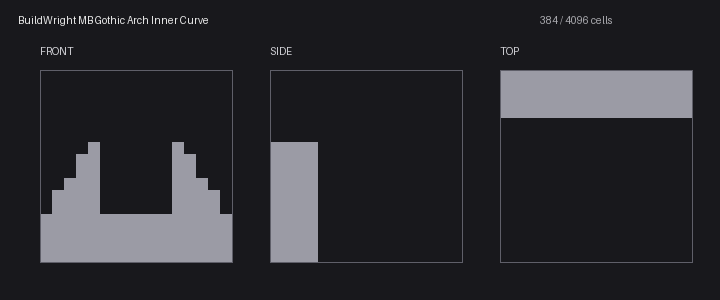 <b>Gothic Arch Inner Curve</b> <code>gothic_arch_inner_curve</code> 1 × 1 × 1 · — blocks</td>
<td width="33%" valign="top">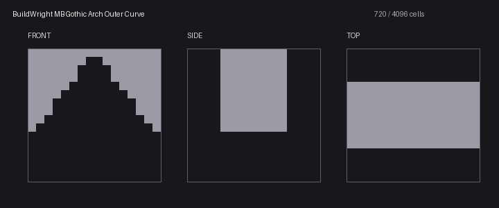 <b>Gothic Arch Outer Curve</b> <code>gothic_arch_outer_curve</code> 1 × 1 × 1 · — blocks</td>
<td></td>
</tr>
</table>

### architecture · capitals

<table>
<tr>
<td width="33%" valign="top">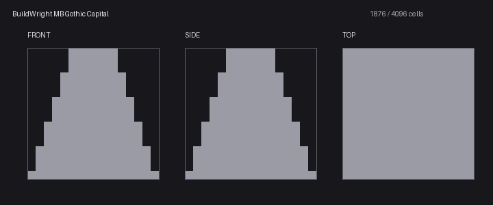 <b>Gothic Capital</b> <code>gothic_capital</code> 1 × 1 × 1 · — blocks</td>
<td></td>
<td></td>
</tr>
</table>

### architecture · columns

<table>
<tr>
<td width="33%" valign="top">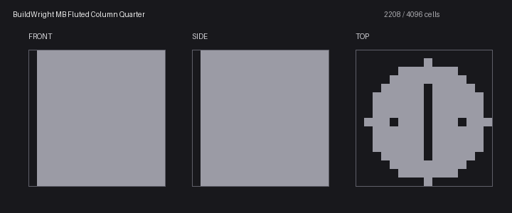 <b>Fluted Column Quarter</b> <code>fluted_column_quarter</code> 1 × 1 × 1 · — blocks</td>
<td></td>
<td></td>
</tr>
</table>

### architecture · contour

<table>
<tr>
<td width="33%" valign="top">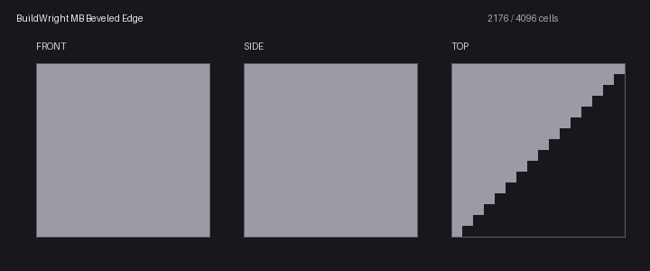 <b>Beveled Edge</b> <code>beveled_edge</code> 1 × 1 × 1 · — blocks</td>
<td width="33%" valign="top">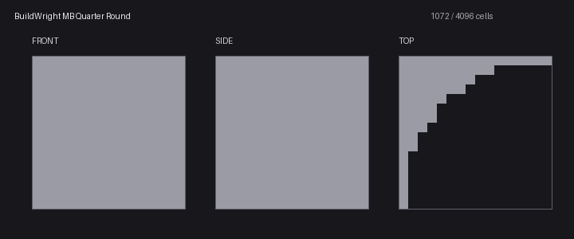 <b>Quarter Round</b> <code>quarter_round</code> 1 × 1 × 1 · — blocks</td>
<td></td>
</tr>
</table>

### architecture · corbels

<table>
<tr>
<td width="33%" valign="top">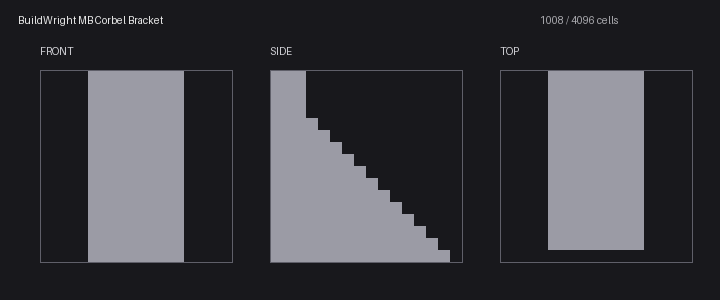 <b>Corbel Bracket</b> <code>corbel_bracket</code> 1 × 1 × 1 · — blocks</td>
<td></td>
<td></td>
</tr>
</table>

### architecture · railings

<table>
<tr>
<td width="33%" valign="top">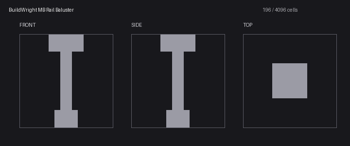 <b>Rail Baluster</b> <code>rail_baluster</code> 1 × 1 × 1 · — blocks</td>
<td width="33%" valign="top">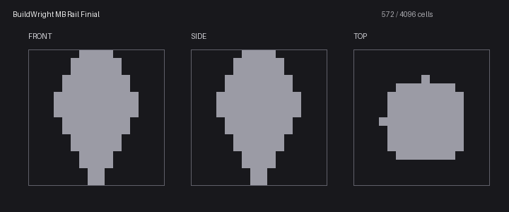 <b>Rail Finial</b> <code>rail_finial</code> 1 × 1 × 1 · — blocks</td>
<td></td>
</tr>
</table>

### architecture · roofs

<table>
<tr>
<td width="33%" valign="top">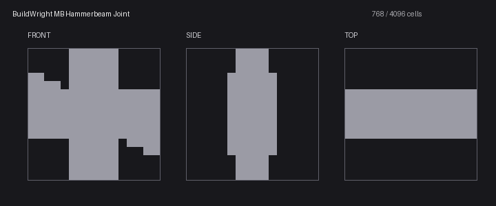 <b>Hammerbeam Joint</b> <code>hammerbeam_joint</code> 1 × 1 × 1 · — blocks</td>
<td></td>
<td></td>
</tr>
</table>

### architecture · stairs

<table>
<tr>
<td width="33%" valign="top">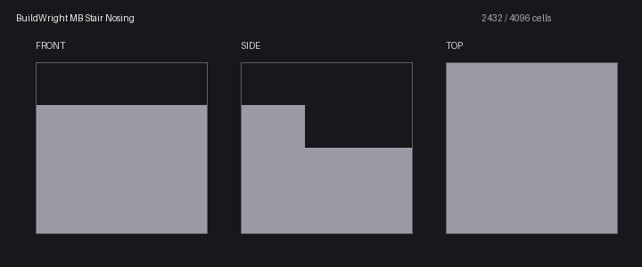 <b>Stair Nosing</b> <code>stair_nosing</code> 1 × 1 × 1 · — blocks</td>
<td></td>
<td></td>
</tr>
</table>

### architecture · trim

<table>
<tr>
<td width="33%" valign="top">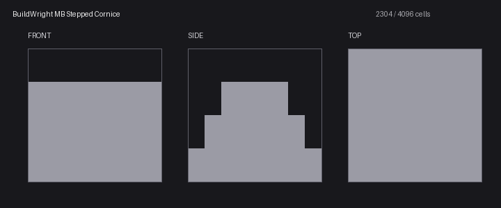 <b>Stepped Cornice</b> <code>stepped_cornice</code> 1 × 1 × 1 · — blocks</td>
<td></td>
<td></td>
</tr>
</table>

### architecture · windows

<table>
<tr>
<td width="33%" valign="top">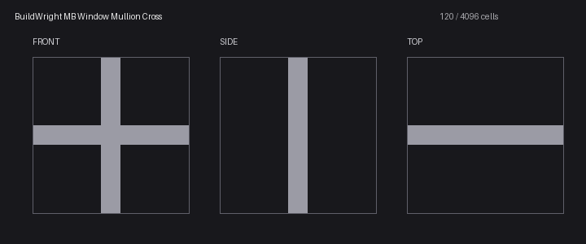 <b>Window Mullion Cross</b> <code>window_mullion_cross</code> 1 × 1 × 1 · — blocks</td>
<td width="33%" valign="top">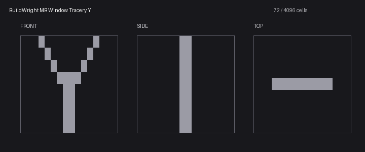 <b>Window Tracery Y</b> <code>window_tracery_y</code> 1 × 1 × 1 · — blocks</td>
<td></td>
</tr>
</table>

### decor · crests

<table>
<tr>
<td width="33%" valign="top">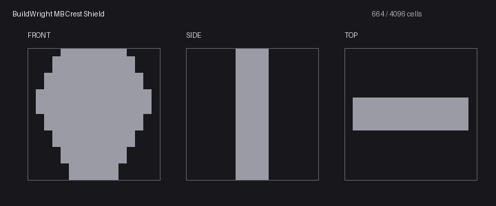 <b>Crest Shield</b> <code>crest_shield</code> 1 × 1 × 1 · — blocks</td>
<td></td>
<td></td>
</tr>
</table>

### decor · frames

<table>
<tr>
<td width="33%" valign="top">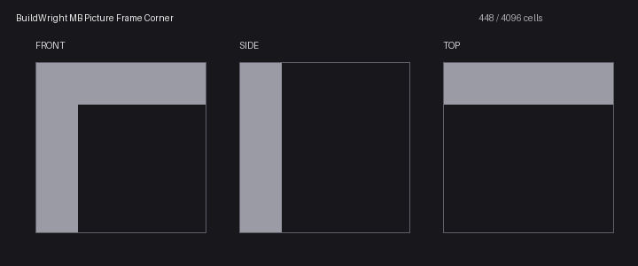 <b>Picture Frame Corner</b> <code>picture_frame_corner</code> 1 × 1 × 1 · — blocks</td>
<td></td>
<td></td>
</tr>
</table>

### decor · lighting

<table>
<tr>
<td width="33%" valign="top">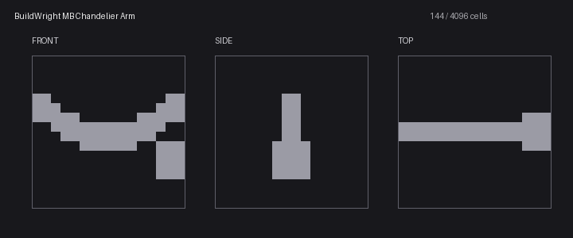 <b>Chandelier Arm</b> <code>chandelier_arm</code> 1 × 1 × 1 · — blocks</td>
<td></td>
<td></td>
</tr>
</table>

### decor · statues

<table>
<tr>
<td width="33%" valign="top">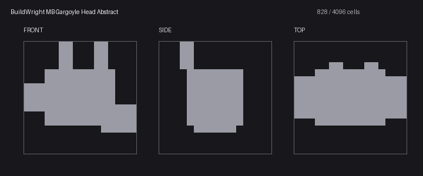 <b>Gargoyle Head Abstract</b> <code>gargoyle_head_abstract</code> 1 × 1 × 1 · — blocks</td>
<td></td>
<td></td>
</tr>
</table>

### furniture · legs

<table>
<tr>
<td width="33%" valign="top">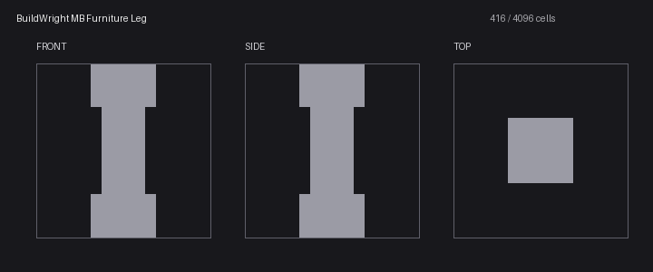 <b>Furniture Leg</b> <code>furniture_leg</code> 1 × 1 × 1 · — blocks</td>
<td></td>
<td></td>
</tr>
</table>

### furniture · seating

<table>
<tr>
<td width="33%" valign="top">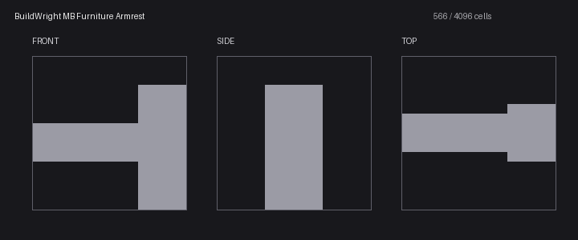 <b>Furniture Armrest</b> <code>furniture_armrest</code> 1 × 1 × 1 · — blocks</td>
<td></td>
<td></td>
</tr>
</table>

### lighting · fixtures

<table>
<tr>
<td width="33%" valign="top">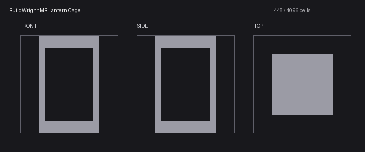 <b>Lantern Cage</b> <code>lantern_cage</code> 1 × 1 × 1 · — blocks</td>
<td></td>
<td></td>
</tr>
</table>

### mechanical · consoles

<table>
<tr>
<td width="33%" valign="top">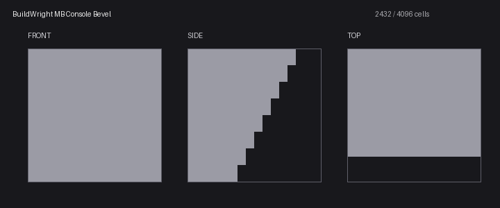 <b>Console Bevel</b> <code>console_bevel</code> 1 × 1 × 1 · — blocks</td>
<td></td>
<td></td>
</tr>
</table>

### mechanical · grilles

<table>
<tr>
<td width="33%" valign="top">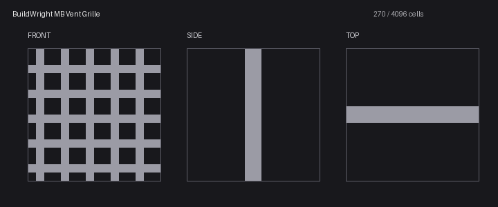 <b>Vent Grille</b> <code>vent_grille</code> 1 × 1 × 1 · — blocks</td>
<td></td>
<td></td>
</tr>
</table>

### mechanical · pipes

<table>
<tr>
<td width="33%" valign="top">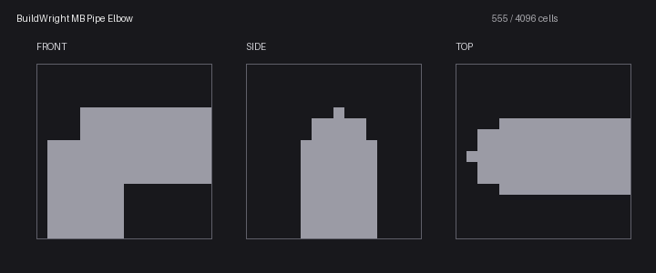 <b>Pipe Elbow</b> <code>pipe_elbow</code> 1 × 1 × 1 · — blocks</td>
<td></td>
<td></td>
</tr>
</table>
