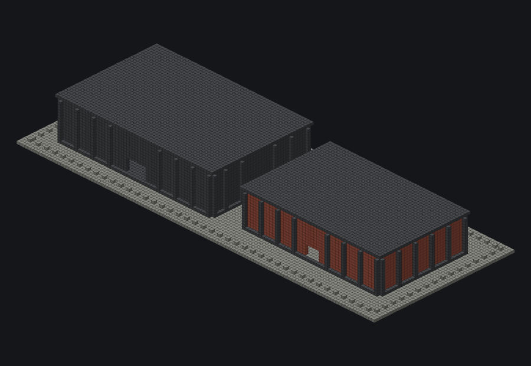
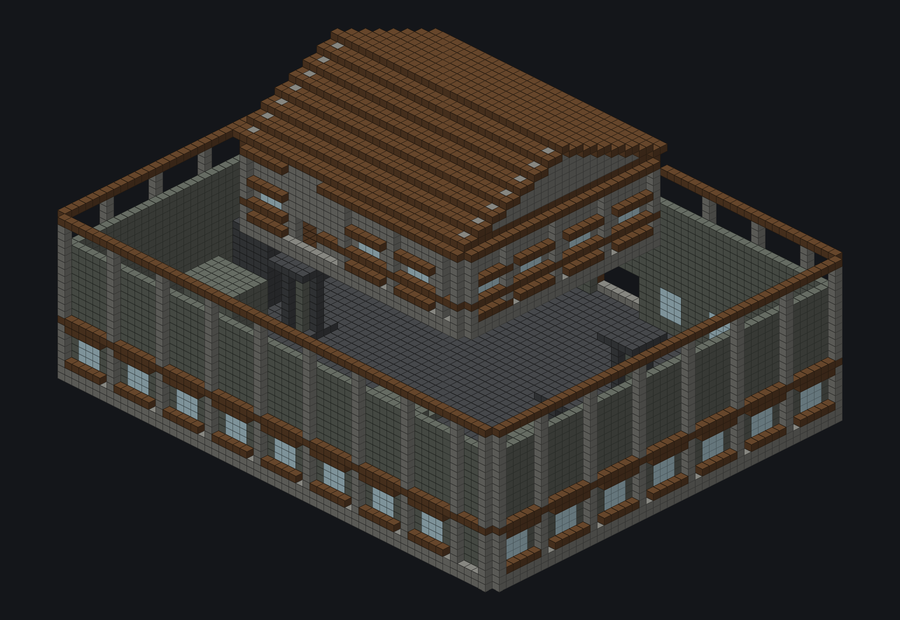
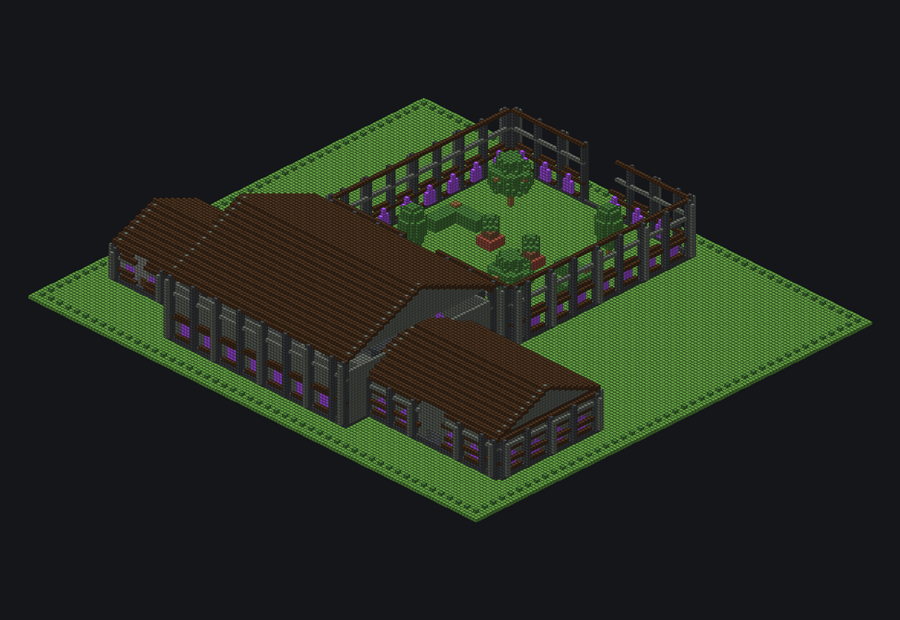

# Whole-Building Visual Catalogue

[← Visual Catalogue](../../VISUAL_CATALOG.md)

<table>
<tr>
<td width="33%" valign="top"> <b>Industrial Campus</b> <code>industrial_campus</code> 130 × 18 × 51 · 25664 blocks · OFFLINE_COMPILED</td>
<td width="33%" valign="top"> <b>Two Floor Manor</b> <code>two_floor_manor</code> 63 × 44 × 51 · 16032 blocks · OFFLINE_COMPILED</td>
<td width="33%" valign="top"> <b>Wayne Manor Phase A</b> <code>wayne_manor_phase_a</code> 155 × 38 × 137 · 59485 blocks · OFFLINE_COMPILED</td>
</tr>
</table>
