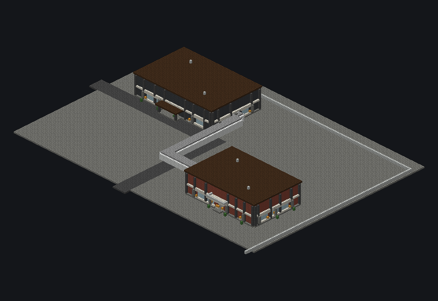
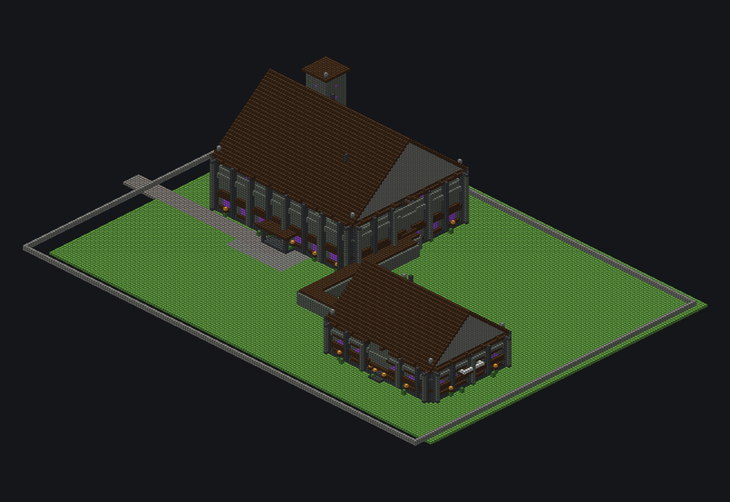
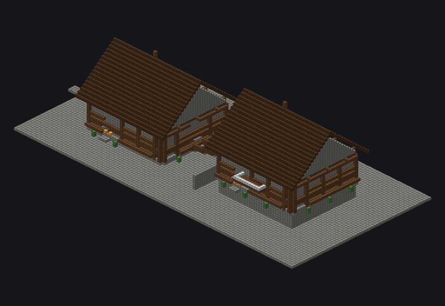

# Structural & Site Intelligence

[← Vanilla Visual Catalogue](../../VISUAL_CATALOG.md)

**These vanilla projects exercise project-scale circulation, structure and site systems.** Routed corridors, elevation stairs, towers/porches/balconies/buttresses, foundations, roads/plazas/walls/fences/retaining walls are all compiled geometry.

> These remain offline regression projects and still require in-game/player-eye review.

<table>
<tr>
<td width="33%" valign="top"> <b>Modern Campus Network</b> <code>modern_campus_network</code> 181 × 20 × 129 · 45141 blocks · STRUCTURAL/SITE REGRESSION</td>
<td width="33%" valign="top"> <b>Routed Gothic Estate</b> <code>routed_gothic_estate</code> 186 × 51 × 129 · 54835 blocks · STRUCTURAL/SITE REGRESSION</td>
<td width="33%" valign="top"> <b>Terraced Hillside Compound</b> <code>terraced_hillside_compound</code> 123 × 37 × 59 · 21190 blocks · STRUCTURAL/SITE REGRESSION</td>
</tr>
</table>
