# Style-Family Vanilla Finish

[← Vanilla Visual Catalogue](../../VISUAL_CATALOG.md)

**These projects exercise one dedicated finishing grammar for each architectural family.** They extend VANILLA_DETAIL_COMPLETE with family-specific exterior rhythm, eaves, corner structure, lighting, planting, service runs, parapets and finials.

> These are deterministic pure-vanilla regression outputs and remain LIVE_GAME_PENDING until in-game review.

<table>
<tr>
<td width="33%" valign="top">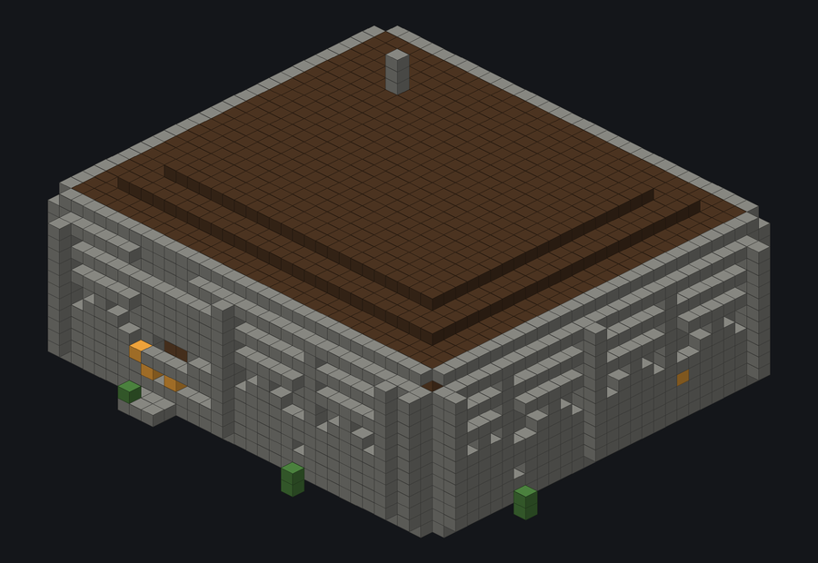 <b>Style Finish Ancient</b> <code>style_finish_ancient</code> 37 × 19 × 33 · 7104 blocks · STYLE-FAMILY FINISH</td>
<td width="33%" valign="top">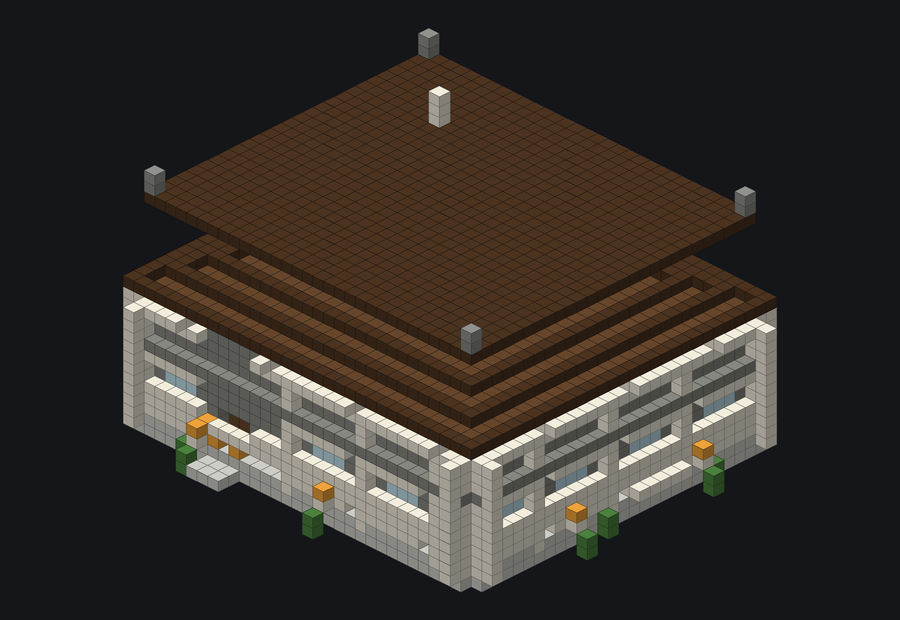 <b>Style Finish Classical</b> <code>style_finish_classical</code> 37 × 25 × 33 · 6395 blocks · STYLE-FAMILY FINISH</td>
<td width="33%" valign="top">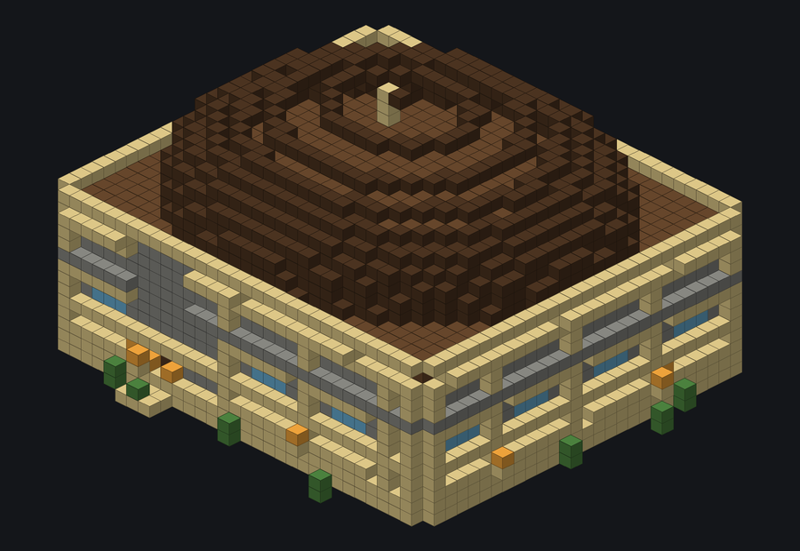 <b>Style Finish Desert</b> <code>style_finish_desert</code> 37 × 23 × 33 · 5661 blocks · STYLE-FAMILY FINISH</td>
</tr>
<tr>
<td width="33%" valign="top">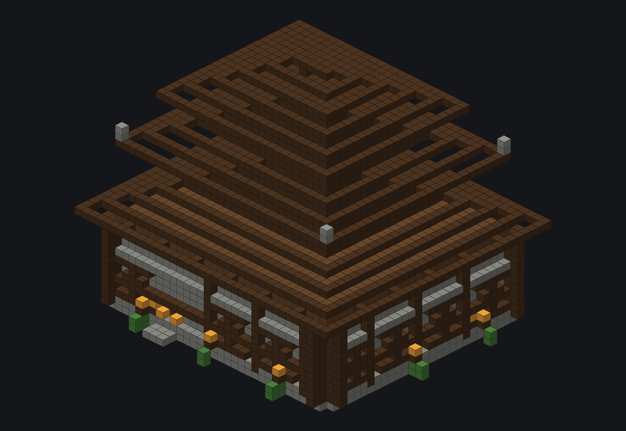 <b>Style Finish East Asian</b> <code>style_finish_east_asian</code> 37 × 36 × 33 · 6427 blocks · STYLE-FAMILY FINISH</td>
<td width="33%" valign="top">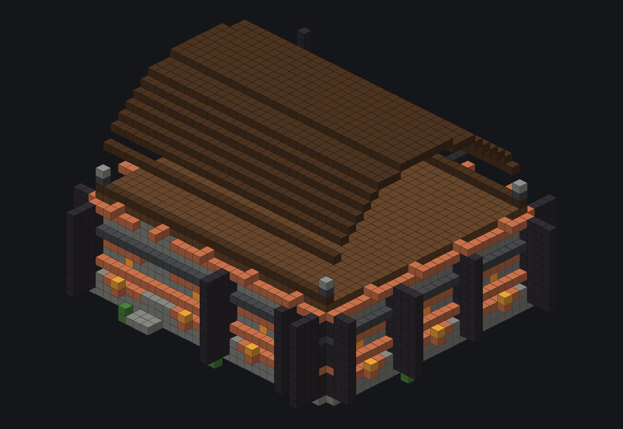 <b>Style Finish Fantasy</b> <code>style_finish_fantasy</code> 39 × 28 × 35 · 6157 blocks · STYLE-FAMILY FINISH</td>
<td width="33%" valign="top">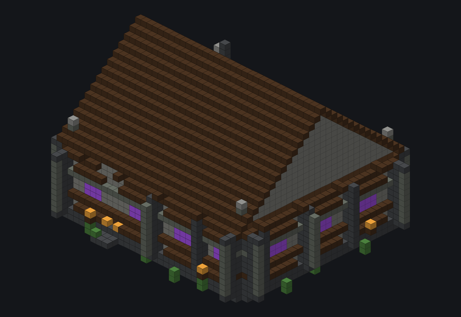 <b>Style Finish Gothic</b> <code>style_finish_gothic</code> 37 × 28 × 33 · 6527 blocks · STYLE-FAMILY FINISH</td>
</tr>
<tr>
<td width="33%" valign="top">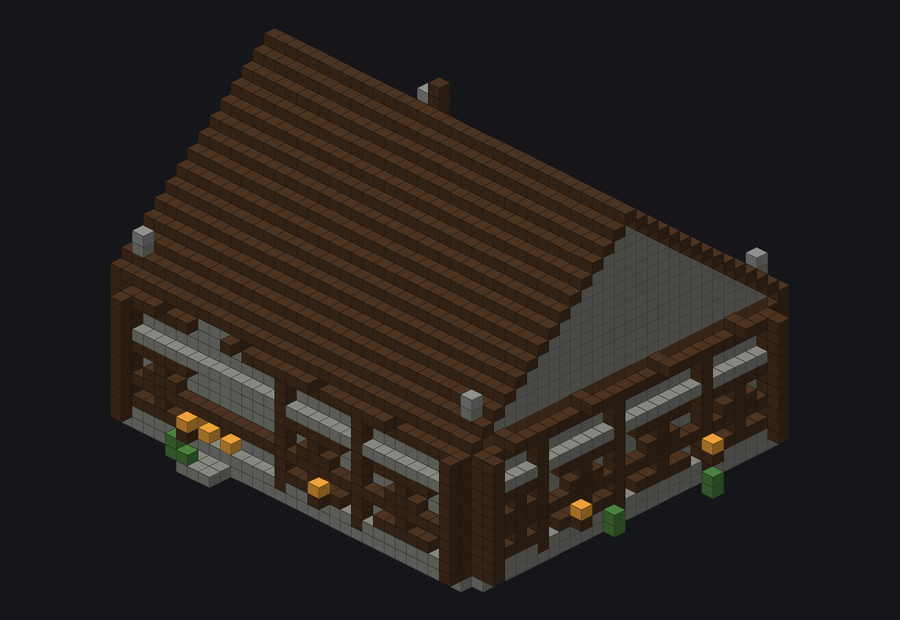 <b>Style Finish Historic European</b> <code>style_finish_historic_european</code> 37 × 28 × 33 · 6349 blocks · STYLE-FAMILY FINISH</td>
<td width="33%" valign="top">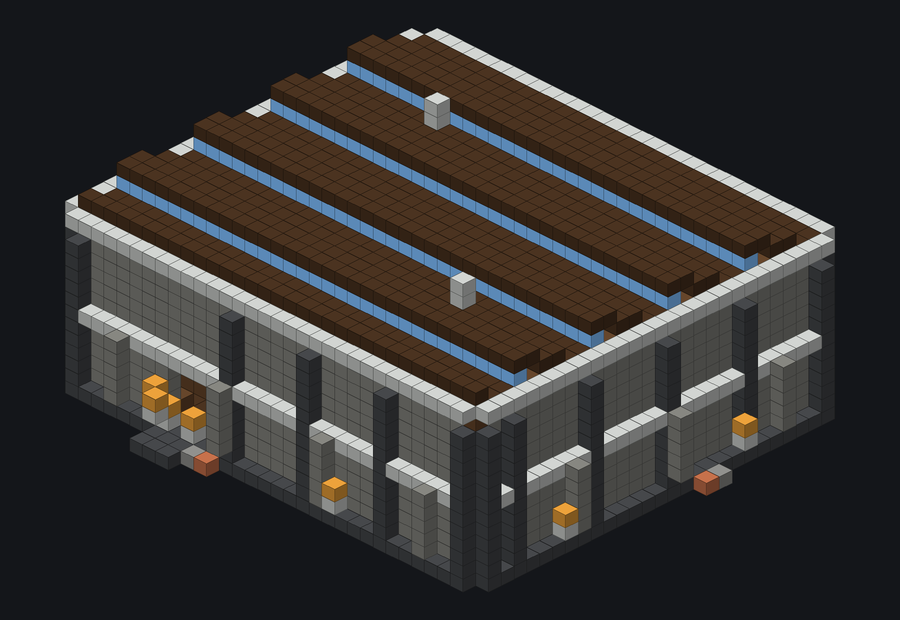 <b>Style Finish Industrial</b> <code>style_finish_industrial</code> 35 × 17 × 32 · 5699 blocks · STYLE-FAMILY FINISH</td>
<td width="33%" valign="top">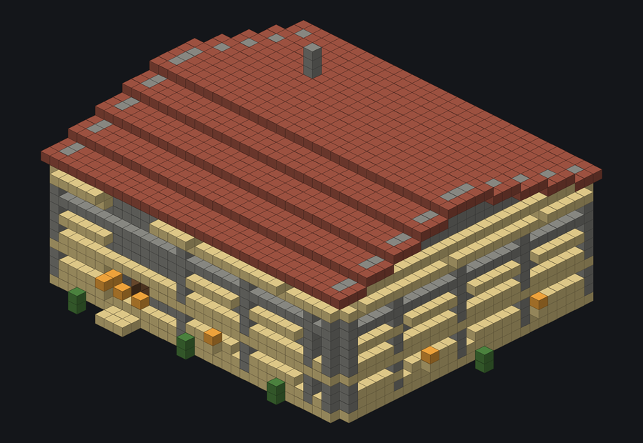 <b>Style Finish Mediterranean</b> <code>style_finish_mediterranean</code> 37 × 19 × 33 · 6057 blocks · STYLE-FAMILY FINISH</td>
</tr>
<tr>
<td width="33%" valign="top">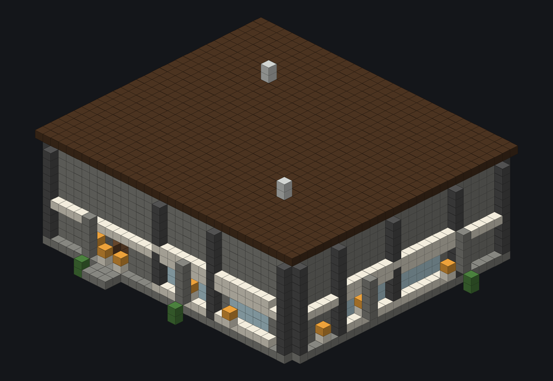 <b>Style Finish Modern</b> <code>style_finish_modern</code> 37 × 16 × 32 · 5482 blocks · STYLE-FAMILY FINISH</td>
<td width="33%" valign="top">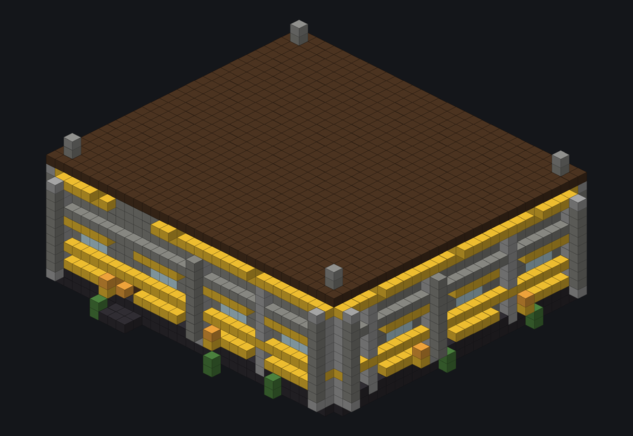 <b>Style Finish Modern Historic</b> <code>style_finish_modern_historic</code> 36 × 16 × 33 · 5911 blocks · STYLE-FAMILY FINISH</td>
<td width="33%" valign="top">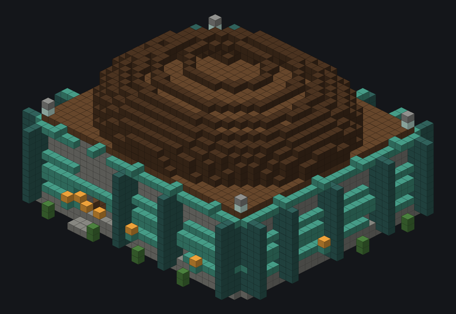 <b>Style Finish Organic</b> <code>style_finish_organic</code> 37 × 23 × 33 · 5959 blocks · STYLE-FAMILY FINISH</td>
</tr>
<tr>
<td width="33%" valign="top">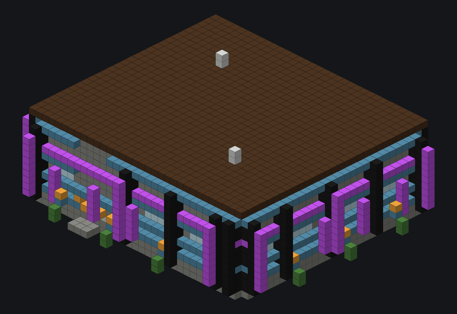 <b>Style Finish Speculative</b> <code>style_finish_speculative</code> 37 × 16 × 33 · 6197 blocks · STYLE-FAMILY FINISH</td>
<td width="33%" valign="top">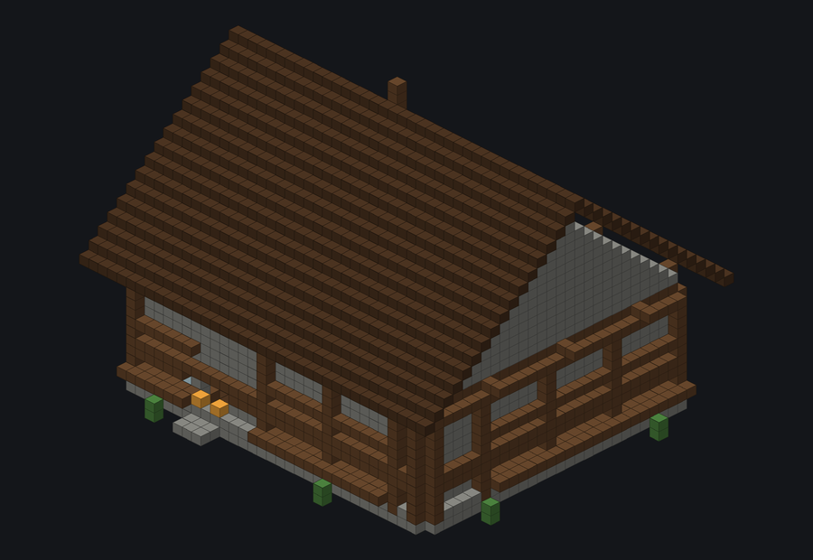 <b>Style Finish Vernacular</b> <code>style_finish_vernacular</code> 37 × 30 × 33 · 6529 blocks · STYLE-FAMILY FINISH</td>
<td></td>
</tr>
</table>
