# Vanilla Detail Complete

[← Vanilla Visual Catalogue](../../VISUAL_CATALOG.md)

**These examples have passed the automated vanilla finishing pipeline.** They include secondary architecture, furnishing, lighting, vegetation/service detail, and controlled storytelling without Astra Microblocks.

> VANILLA_DETAIL_COMPLETE is still an offline compiler maturity label. It does not replace in-game player-eye review.

## Detailed rooms / role regressions

<table>
<tr>
<td width="33%" valign="top">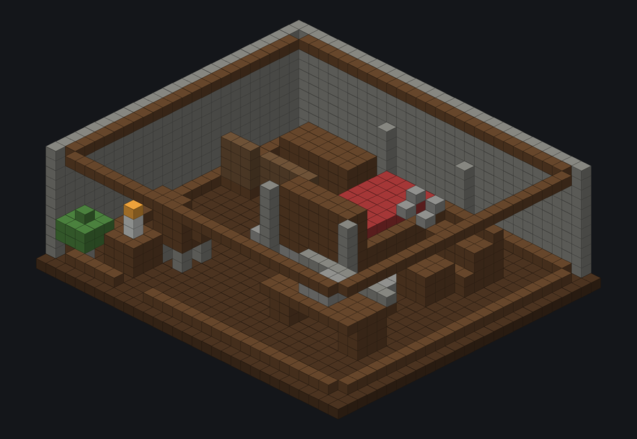 <b>Bedroom Detail Complete</b> <code>bedroom_detail_complete</code> — · 2445 blocks · VANILLA_DETAIL_COMPLETE</td>
<td width="33%" valign="top">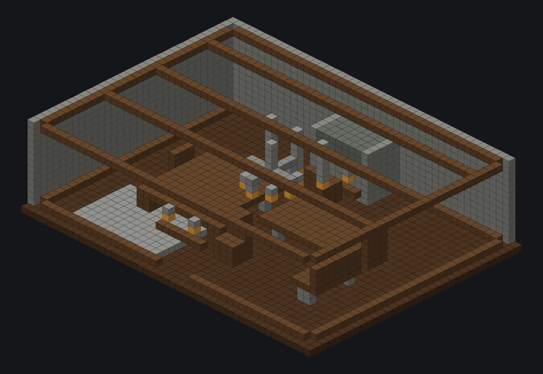 <b>Formal Dining Detail Complete</b> <code>formal_dining_detail_complete</code> — · 3803 blocks · VANILLA_DETAIL_COMPLETE</td>
<td width="33%" valign="top">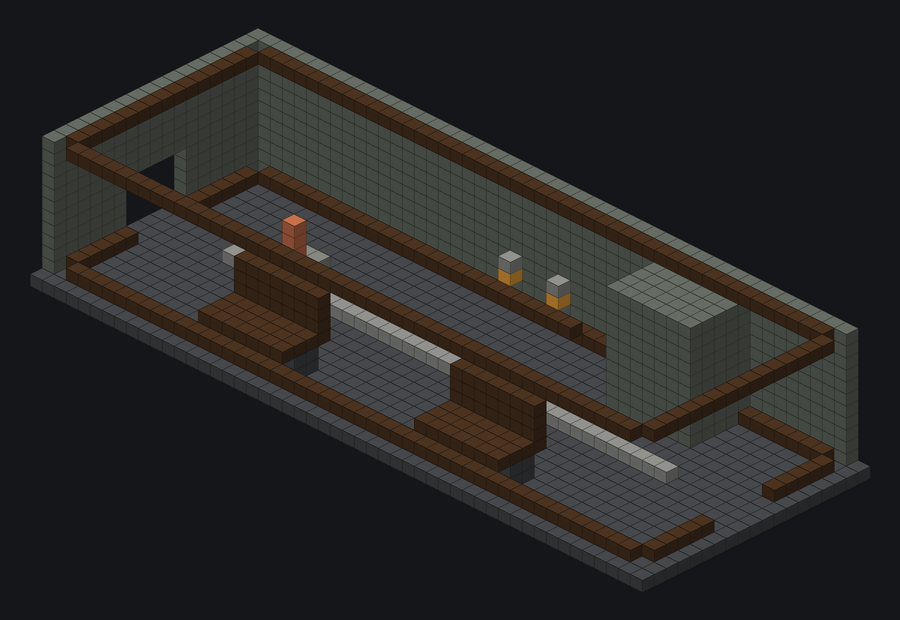 <b>Gallery Detail Complete</b> <code>gallery_detail_complete</code> — · 2364 blocks · VANILLA_DETAIL_COMPLETE</td>
</tr>
<tr>
<td width="33%" valign="top">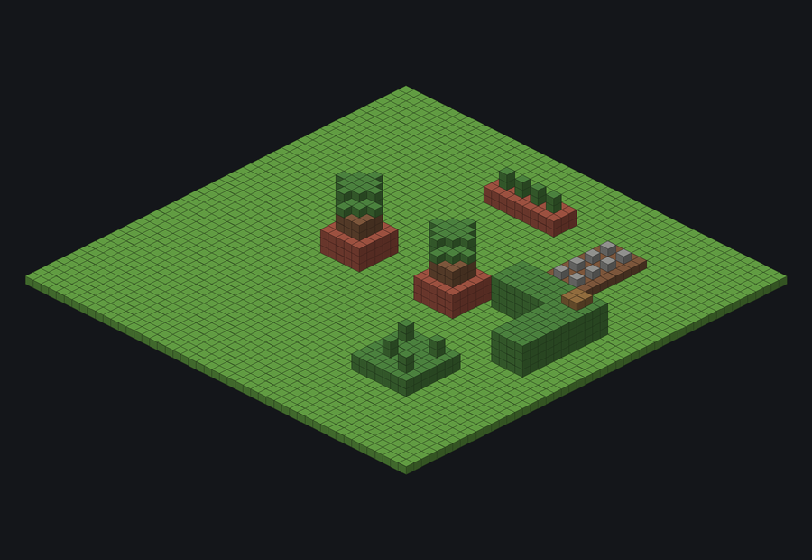 <b>Garden Detail Complete</b> <code>garden_detail_complete</code> — · 3156 blocks · VANILLA_DETAIL_COMPLETE</td>
<td width="33%" valign="top">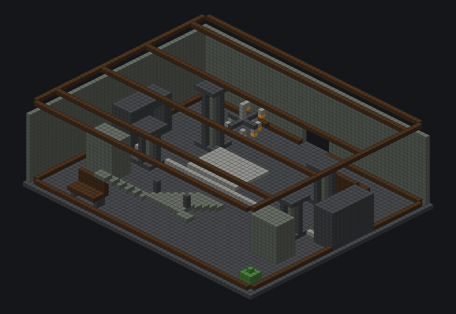 <b>Grand Hall Detail Complete</b> <code>grand_hall_detail_complete</code> — · 7936 blocks · VANILLA_DETAIL_COMPLETE</td>
<td width="33%" valign="top">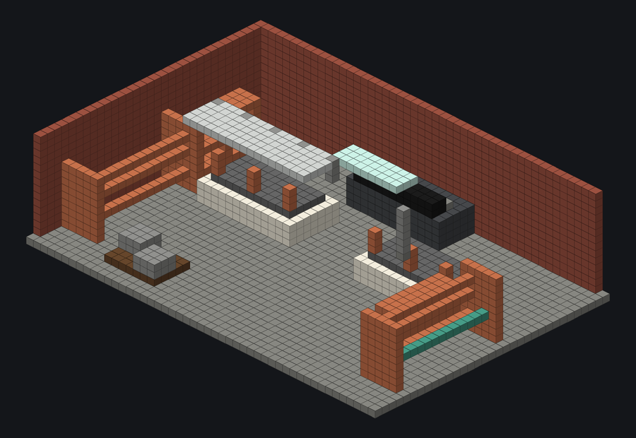 <b>Industrial Lab Detail Complete</b> <code>industrial_lab_detail_complete</code> — · 4423 blocks · VANILLA_DETAIL_COMPLETE</td>
</tr>
<tr>
<td width="33%" valign="top">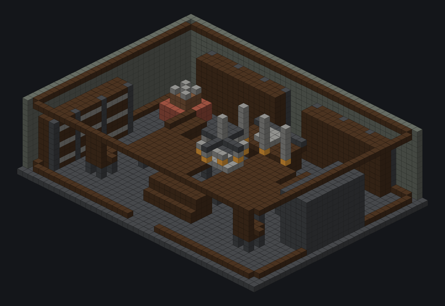 <b>Library Detail Complete</b> <code>library_detail_complete</code> — · 5169 blocks · VANILLA_DETAIL_COMPLETE</td>
<td width="33%" valign="top">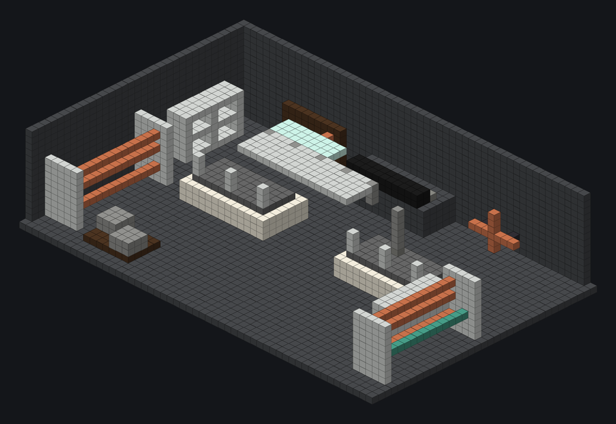 <b>Operations Bay Detail Complete</b> <code>operations_bay_detail_complete</code> — · 4915 blocks · VANILLA_DETAIL_COMPLETE</td>
<td width="33%" valign="top">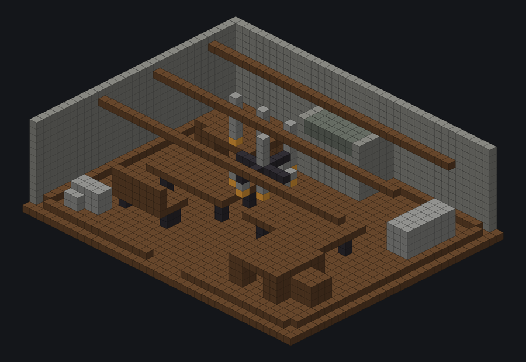 <b>Tavern Detail Complete</b> <code>tavern_detail_complete</code> — · 3158 blocks · VANILLA_DETAIL_COMPLETE</td>
</tr>
<tr>
<td width="33%" valign="top">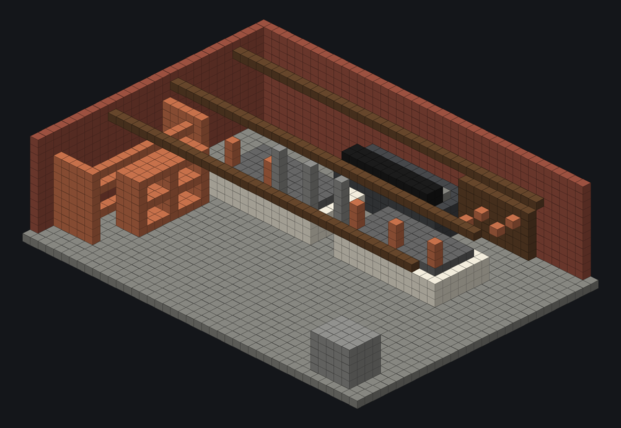 <b>Workshop Detail Complete</b> <code>workshop_detail_complete</code> — · 3722 blocks · VANILLA_DETAIL_COMPLETE</td>
<td></td>
<td></td>
</tr>
</table>

## Detailed whole-building regressions

<table>
<tr>
<td width="33%" valign="top">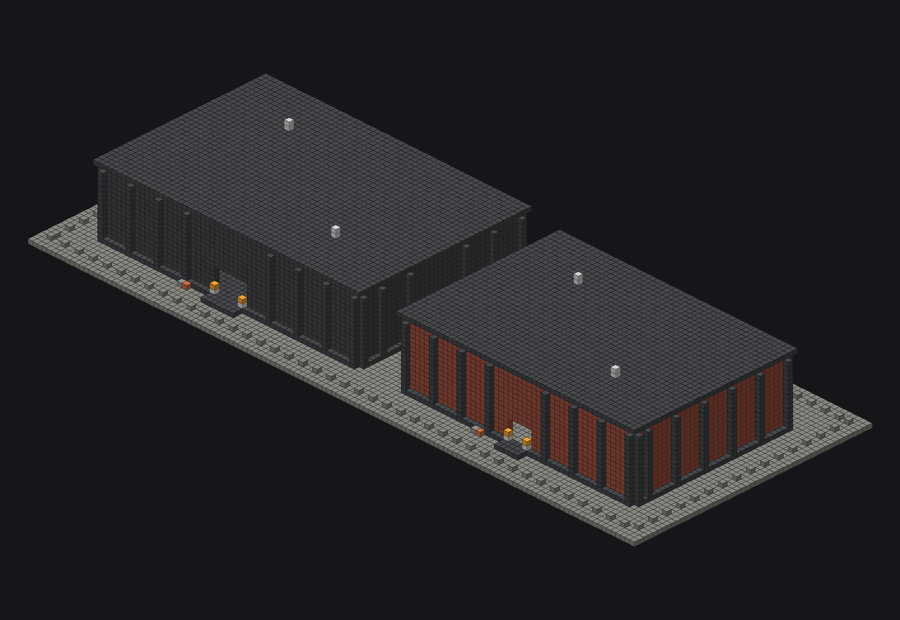 <b>Industrial Campus Vanilla Detail</b> <code>industrial_campus_vanilla_detail</code> 130 × 20 × 51 · 27222 blocks · VANILLA_DETAIL_COMPLETE</td>
<td width="33%" valign="top">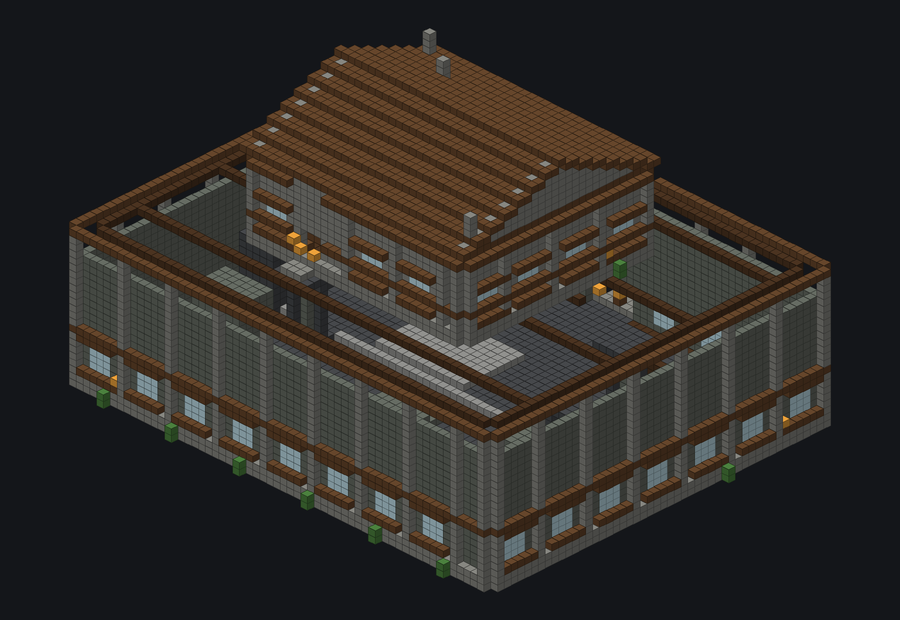 <b>Two Floor Manor Vanilla Detail</b> <code>two_floor_manor_vanilla_detail</code> 65 × 44 × 54 · 17551 blocks · VANILLA_DETAIL_COMPLETE</td>
<td width="33%" valign="top">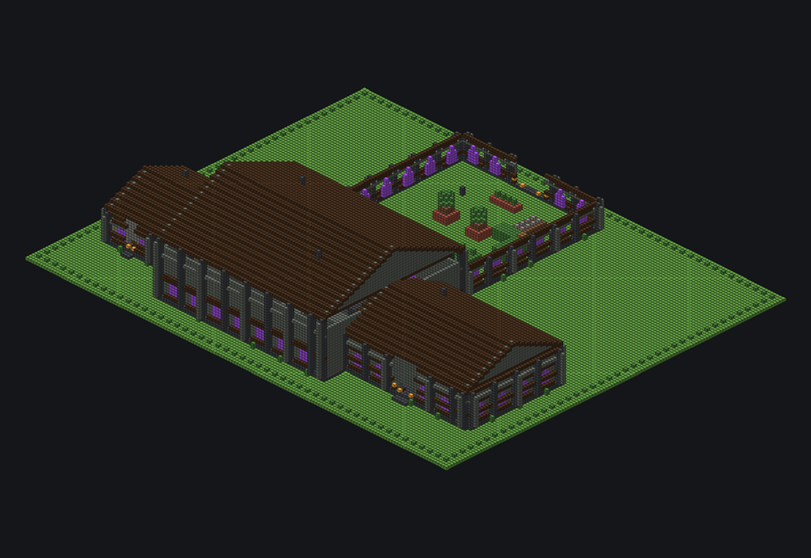 <b>Wayne Manor Phase A Vanilla Detail</b> <code>wayne_manor_phase_a_vanilla_detail</code> 155 × 38 × 125 · 55656 blocks · VANILLA_DETAIL_COMPLETE</td>
</tr>
</table>
